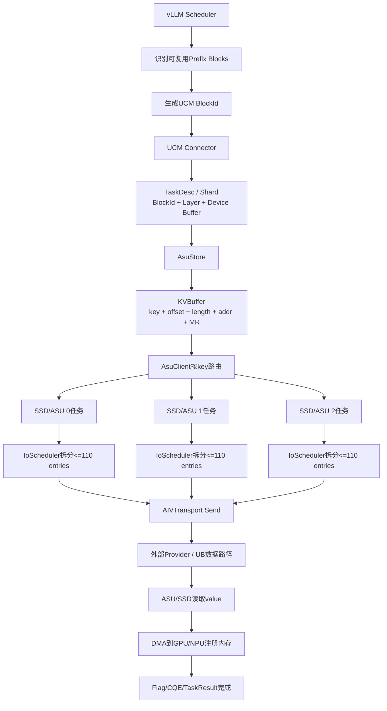
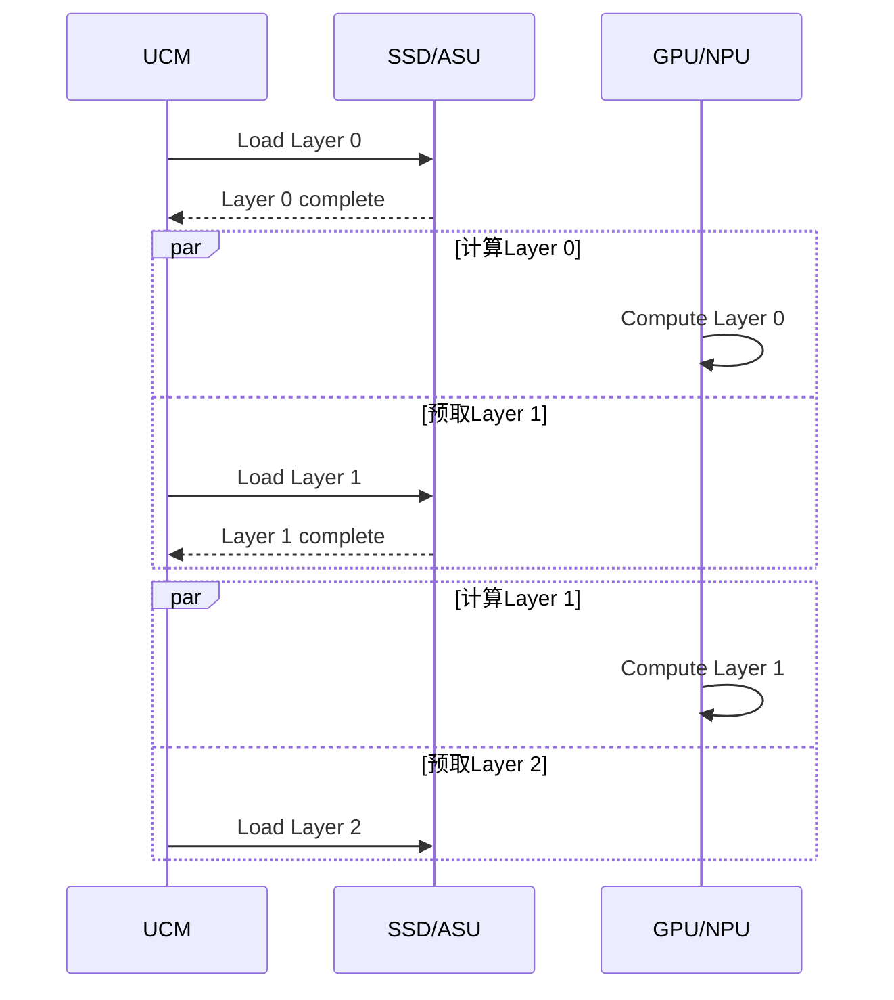

# 从零理解 KV 语义 SSD 访问：与 NVMe 块读取的区别及其在 PD 分离中的价值

> 面向第一次接触 KV 存储、NVMe 和 UCM/ASU 的读者。
>
> 本文重点讨论：LLM 的 KV Cache 如何作为存储对象被写入和读取，以及 UCM 的 `KV over UB` 接口与传统 NVMe 块接口有什么不同。

## 0. 先看结论

传统 NVMe 块读取说的是：

```text
请从 namespace 1 的第 1,000,000 个逻辑块开始，连续读取 36 个 4 KiB 块，
把数据放到主机给出的内存地址。
```

KV 语义读取说的是：

```text
请读取 key=0x1234... 对应的对象，
从对象内部 offset=1,032,192 字节处开始读取 147,456 字节，
把数据放到客户端给出的已注册设备内存地址。
```

最关键的区别不是“数据内容不同”，而是**寻址方式和映射责任不同**：

| 问题 | 传统 NVMe 块接口 | KV 语义接口 |
|---|---|---|
| 用什么找到数据 | `NSID + SLBA + NLB` | `key + offset + length` |
| 谁维护“对象→物理位置” | 主机软件先维护对象到 LBA 的映射；SSD 再维护 LBA 到 Flash 的映射 | KV 存储服务/设备维护 key 到 value/介质位置的映射 |
| 对应用暴露什么 | 逻辑块 | 对象或记录 |
| 数据搬到哪里 | PRP/SGL 指向的内存 | `device_addr + MR key` 指向的已注册设备内存 |
| 是否天然知道“这是 KV Cache” | 不知道 | 存储层知道 key/value 边界，但通常仍不知道模型语义、层 deadline 等 |
| 是否天然提高 SSD 物理带宽 | 否 | 否 |

在 PD 分离场景下，KV 语义通常更适合做缓存对象的查找、路由、批处理、生命周期管理和跨节点共享；但它**不保证一定比优化良好的 NVMe 数据路径更快**。它的主要价值是减少上层映射和管理复杂度，而不是把一块 40 GB/s SSD 变成更高带宽的设备。

还要特别注意：**KV、NVMe、UB 不完全处于同一层级**。

| 维度 | 可选项示例 | 回答的问题 |
|---|---|---|
| 应用/存储语义 | KV 对象、块设备、文件 | 应用用什么名字找数据 |
| 命令集 | UCM KV SQE、NVMe NVM、标准 NVMe-KV | 主机向存储提交什么命令 |
| 传输 | UB、PCIe、RDMA、TCP | 命令和数据如何跨链路传输 |

因此，“UCM KV over UB”和“本地 PCIe NVMe Read”是两条完整栈的比较；不能简单推导为“KV 是 UB，NVMe 不是网络”。NVMe 也可以通过 RDMA/TCP 等 Fabrics transport，KV 服务内部也可能继续调用块设备。

---

## 1. 先消除一个最容易出现的混淆：这里有两种“KV”

### 1.1 Transformer 中的 K/V

在 Attention 中，每个 token 会产生 Key tensor 和 Value tensor：

```text
Attention(Q, K, V)
```

推理时，历史 token 的 K/V 会被保存，后续 token 无需重新计算，这部分数据叫 **KV Cache**。

这里的 K/V 是模型张量的名字。

### 1.2 存储系统中的 key/value

KV 存储把数据组织成：

```text
key  →  value
```

例如：

```text
key   = 某个 token-prefix block 的唯一标识
value = 这个 block 对应的模型 KV Cache 字节
```

这里的 key/value 是存储对象的寻址方式。

### 1.3 两者如何结合

在 UCM/ASU 场景中，可以理解为：

```text
存储 key
  ↓
定位一个 token block 对象
  ↓
该对象的 value 内部保存模型各层的 K/V tensor 字节
```

因此：

- “存储 key”不是 Attention 的 K tensor；
- “存储 value”中装的是模型 KV Cache 数据；
- `offset` 用来选择 value 内的某一层或某个 tensor 片段。

---

## 2. 为什么 LLM 要把 KV Cache 放到外部 SSD

长上下文推理的 KV Cache 很大，而 GPU/NPU HBM 容量有限。典型处理方式包括：

1. 将历史 KV Cache 持久化到外部内存或 SSD；
2. 新请求到来时先查询相同 prefix 是否命中；
3. 命中后读取已有 KV Cache；
4. 避免重新执行对应 token 的 Prefill 计算；
5. 把节省出的算力用于更多请求或更长上下文。

UCM 的核心目标正是持久化和复用 LLM KV Cache，并提供 prefix caching、PD 分离和外部存储连接能力。[UCM 项目说明](https://github.com/ModelEngine-Group/unified-cache-management)

这里存在一个基本权衡：

```text
重新计算KV的时间  vs.  从外部存储读取KV的时间
```

只有当读取足够快时，复用 KV Cache 才真正降低 TTFT。

---

## 3. 什么是“块语义”

### 3.1 SSD 最传统的抽象：一串有编号的逻辑块

传统块设备向主机暴露：

```text
LBA 0
LBA 1
LBA 2
...
```

假设一个逻辑块是 4 KiB，那么主机读取 144 KiB 需要读取：

```text
144 KiB / 4 KiB = 36 个逻辑块
```

块接口只关心：

```text
从哪个LBA开始？
连续多少个LBA？
数据放到哪里？
```

它不知道这 144 KiB 是：

- KV Cache；
- 数据库记录；
- 图片；
- 日志；
- 文件的一部分。

### 3.2 NVMe 是什么

NVMe 定义了主机如何通过 Submission Queue 向 SSD 控制器提交命令，以及 SSD 如何通过 Completion Queue 返回完成状态。

NVMe 2.x 把规范拆成几层：

```text
NVMe Base Specification
  ├─ NVM Command Set：传统块Read/Write
  ├─ Key Value Command Set：标准NVMe-KV
  └─ Transport：PCIe、RDMA、TCP等
```

传统的 NVMe Read/Write 属于 NVM Command Set，也就是块地址命令集。[NVM Express NVM Command Set](https://nvmexpress.org/specification/nvm-command-set-specification/)

### 3.3 一个 NVMe Read SQE 的核心字段

NVMe SQE 通常是 64 字节。对于普通 NVM Read，核心字段如下：

| 字段 | 含义 | 初学者理解 |
|---|---|---|
| `OPC` | Opcode | 是 Read、Write 还是其他命令 |
| `FUSE` | Fused Operation | 是否与下一条命令构成规范定义的融合操作；普通读写通常不用 |
| `PSDT` | PRP or SGL for Data Transfer | 指定 `DPTR` 按 PRP 还是 SGL 解释 |
| `CID` | Command Identifier | 主机给命令分配的编号，用来匹配 CQE |
| `NSID` | Namespace Identifier | 访问哪个 namespace |
| `MPTR` | Metadata Pointer | 可选元数据地址 |
| `DPTR` | Data Pointer | PRP 或 SGL，描述数据目标内存 |
| `SLBA` | Starting LBA | 第一个逻辑块地址 |
| `NLB` | Number of Logical Blocks | 连续读取多少块，字段编码为 0-based |
| `FUA` | Force Unit Access | 要求从非易失介质取得/提交数据，不能只依赖易失缓存语义 |
| `LR` | Limited Retry | 是否限制错误恢复重试 |
| `PRINFO/STC` | Protection Information | 端到端数据保护相关控制 |
| `DSM` | Dataset Management hints | 顺序性、访问频率、期望时延等提示 |

NVMe NVM Read 规范明确使用 64 位 `SLBA`，`NLB` 是 0-based；数据目标由 PRP/SGL 描述。[NVMe NVM Read 字段](https://nvmexpress.org/wp-content/uploads/NVM-Express-NVM-Command-Set-Specification-Revision-1.3-Ratified-2026.07.31.pdf#page=49)

补充两点：

- `NSID` 选择的是当前 NVMe controller 内的 namespace；多块物理 SSD 时，主机还要先选定 controller/连接，不能只靠 NSID 找到任意一块盘；
- NVMe Read 的 `OPC=0x02`，Write 的 `OPC=0x01`；`CID` 不是 Queue ID，也不是 KV key。

### 3.4 PRP/SGL 是什么

SSD 不仅要知道“读哪个 LBA”，还要知道“把数据搬到主机的哪里”。

- PRP：Physical Region Page，常用于描述一页或多页内存；
- SGL：Scatter Gather List，可描述一个或多个不连续内存区域。

因此一个 NVMe Read 可以简化成：

```text
Read(
    nsid,
    slba,
    nlb,
    destination_memory
)
```

SSD 完成后写 CQE。CQE 至少携带关联的 `CID`、Submission Queue 标识/头指针、状态码和 phase bit；主机据此知道哪条命令完成，而不是靠观察数据缓冲区猜测完成。

### 3.5 读取 144 KiB 的 NVMe 示例

假设：

```text
namespace       = 1
LBA size        = 4 KiB
KV片段所在SLBA  = 1,000,000
数据长度        = 144 KiB
目标内存        = GPU/NPU已映射缓冲区
```

则：

```text
实际逻辑块数量 = 36
NLB字段值       = 35      # 因为NLB是0-based
SLBA            = 1,000,000
```

命令语义是：

```text
从namespace 1的LBA 1,000,000开始读取36个4KiB逻辑块，
将144KiB数据写入PRP/SGL描述的内存。
```

### 3.6 块接口没有解决的事情

如果上层只知道：

```text
我要读取BlockId = ABC的Layer 7 KV
```

在提交 NVMe Read 之前，主机软件必须先回答：

1. ABC 在哪块 SSD？
2. 属于哪个 namespace？
3. 从哪个 SLBA 开始？
4. 占用多少 LBA？
5. Layer 7 在对象中的位置在哪里？
6. 数据被覆盖、删除或迁移后，映射如何更新？
7. 进程重启后，映射如何恢复？
8. 多客户端并发更新时，谁保证一致性？

因此块语义并不是不能保存 KV Cache，而是**对象到块地址的管理责任主要留在主机软件**。

---

## 4. 什么是“KV 语义”

### 4.1 基本数据模型

KV 存储把数据抽象为：

```text
key → value
```

常见操作包括：

| 操作 | 含义 |
|---|---|
| `Store(key, value)` | 写入或更新对象 |
| `Retrieve(key)` | 读取对象 |
| `Exist(key)` / `Query(key)` | 查询对象是否存在 |
| `Delete(key)` | 删除对象 |
| `List()` | 列出 key；并非所有实现或快速路径都必须使用 |

标准 NVMe 也定义了独立的 Key Value Command Set，其中包括 Store、Retrieve、List、Delete 和 Exist；它与传统 NVM Read/Write 是不同的 I/O Command Set。[NVMe Key Value Command Set 1.4](https://nvmexpress.org/wp-content/uploads/NVM-Express-Key-Value-Command-Set-Specification-Revision-1.4-Ratified-2026.07.31.pdf)

### 4.2 最简单的 KV 读取

逻辑上可以写成：

```text
Retrieve(
    key="conversation-prefix-block-42",
    destination=buffer
)
```

KV 服务负责：

1. 查找 key；
2. 找到 value 的内部位置；
3. 从介质读取 value；
4. 将数据返回到客户端缓冲区。

主机不必直接知道 LBA。

### 4.3 为什么 UCM 还需要 offset 和 length

一个 value 可能很大。例如一个 token block 的 value 可以包含模型多个层的 KV 数据：

```text
value(key=Block-A)
├─ Layer 0 KV
├─ Layer 1 KV
├─ Layer 2 KV
├─ ...
└─ Layer 77 KV
```

如果当前只需要 Layer 7，就没必要读取整个 value。因此使用：

```text
key    = Block-A
offset = Layer 7在value中的起始字节
length = Layer 7数据长度
```

这相当于“对象内部的范围读取”。

---

## 5. UCM 中一个 KV Cache 对象是怎样形成的

以下内容基于 UCM `feature_26h1` 的公开实现，并固定到审阅提交 `e55ddc0ab30770e757fd15c4335dd296db72d11b`。最终 AIV/UB Provider 位于外部库，公开代码只能确认到调用 Provider 的边界。

### 5.1 第一级：vLLM token block

vLLM 会把 token 序列分成 block。UCM 为完整 token block 生成稳定的 BlockId，用来识别相同 prefix。

概念上：

```text
tokens[0:128]   → BlockId B0
tokens[128:256] → BlockId B1
tokens[256:384] → BlockId B2
```

BlockId 的目标是内容寻址：相同 token prefix 和必要的模型/缓存元信息，应得到可重复识别的 ID。

当前审阅版本中，UCM RequestHasher 使用 MD5 生成 16 字节逻辑 BlockId。只对完整 token block 生成，并把前一块的哈希纳入后一块的哈希输入，从而形成 prefix 链式标识。它随后还会被 AsuStore 派生为 8 字节 ASU CacheKey；这两个 ID 不应混成一个字段。[UCM BlockId 生成](https://github.com/ModelEngine-Group/unified-cache-management/blob/e55ddc0ab30770e757fd15c4335dd296db72d11b/ucm/integration/vllm/ucm_connector.py#L176-L190)

### 5.2 第二级：TaskDesc / Shard

UCM 从推理框架拿到以下信息：

| 字段 | 作用 |
|---|---|
| `owner/BlockId` | 当前 shard 属于哪个逻辑 token block |
| `shard_index` | 哪一层或哪一个 shard |
| tensor buffer | 本地 GPU/NPU KV tensor 地址及大小 |
| `brief` | 任务的简要描述信息 |
| `prerequisiteHandle` | Dump/Store 前置事件或依赖句柄 |

一个 Shard 可以理解为：

```text
Block B0 的 Layer 7 KV 数据
```

`TaskDesc` 本质上包含一组 Shard，并携带任务描述和可选前置依赖。[TaskDesc/Shard 类型](https://github.com/ModelEngine-Group/unified-cache-management/blob/e55ddc0ab30770e757fd15c4335dd296db72d11b/ucm/store/detail/type/types.h#L33-L67)

### 5.3 第三级：ASU KVBuffer

AsuStore 将上层 Shard 展开成一个或多个 KVBuffer。核心字段为：

| 字段 | 含义 |
|---|---|
| `key` | 由 BlockId 派生的 ASU CacheKey，用来找到远端对象 |
| `offset` | 该 tensor 在远端 value 内的字节偏移 |
| `buffer.region.memoryType` | HOST、HOST_PINNED 或 ASCEND_DEVICE 等内存类型 |
| `buffer.region.addr` | 本地 GPU/NPU/Host 数据地址 |
| `buffer.region.size` | 要传输的 tensor 字节数 |
| `buffer.region.deviceId` | 对应设备标识 |
| `buffer.region.numaNode` | NUMA 节点信息 |
| `buffer.handle` | 已注册内存句柄，传输层从中得到 MR token/key |

注意：

```text
offset      = 远端value内的位置
buffer_addr = 本地GPU/NPU内存位置
```

两者不能混为一谈。

[UCM KVBuffer 类型](https://github.com/ModelEngine-Group/unified-cache-management/blob/e55ddc0ab30770e757fd15c4335dd296db72d11b/ucm/transport/kv/asu/trans/include/asu_transport/types.h#L145-L180)

### 5.4 第四级：按 key 路由到 ASU/SSD

AsuClient 根据 key 做稳定路由：

```text
key B0 → SSD2
key B1 → SSD1
key B2 → SSD0
```

一个 Block 的 key 通常只落到一块 SSD；并不是把一个 144 KiB layer shard 自动切成三份送到三块 SSD。

要同时使用三块 SSD，需要多个不同 key 分布到不同 SSD：

```text
Layer 7需要6个token blocks
├─ SSD0：B2、B3
├─ SSD1：B1、B4
└─ SSD2：B0、B5
```

UCM 的客户端任务管理器按 key 把请求路由到不同 ASU。[AsuClient 路由实现](https://github.com/ModelEngine-Group/unified-cache-management/blob/e55ddc0ab30770e757fd15c4335dd296db72d11b/ucm/transport/kv/asu/client/src/client_task_manager.cpp#L255-L330)

公开实现可配置的路由思路包括 Ring Hash、Maglev、Contiguous Block Affinity 和 Batch Top-K Affinity。默认/具体选择取决于配置。无论哪一种，基本单位仍是“一项 KVBuffer 路由到一个 ASU”，而不是把同一 entry 做数据条带化。[UCM Router 类型](https://github.com/ModelEngine-Group/unified-cache-management/blob/e55ddc0ab30770e757fd15c4335dd296db72d11b/ucm/transport/kv/common/include/kv_common/router.h#L44-L84)

### 5.5 第五级：把多个 KVBuffer 批量打包成 SQE

落到同一 SSD 的多个 entry 可以组成一个 BatchRetrieve 或 BatchStore SQE。

UCM 公开实现中的 BatchRetrieve：

```text
64字节固定Header + N × 36字节Entry
```

默认最大 N 为 110，但服务器 capability 可以把有效上限调低。

---

## 6. UCM BatchRetrieve SQE：逐字段解释

### 6.1 Header 的作用

Header 描述这是一条什么命令、包含多少 entry、完成状态写到哪里。

| 字段 | 含义 | 为什么需要 |
|---|---|---|
| `opcode` | 命令类型，例如 BatchRetrieve | 让 ASU 知道执行读还是写 |
| `CID` | 命令标识 | 将提交和完成对应起来 |
| `RFLAG` | 响应/flag 相关控制 | 指示完成状态处理方式 |
| `kv_ns_id` | KV namespace | 区分逻辑 KV 空间 |
| response/flag address | 完成结果缓冲区地址 | ASU/传输层写回 entry 状态 |
| response MR key | 完成缓冲区的注册内存凭证 | 允许远端访问该缓冲区 |
| descriptor byte length | 所有 entry 的字节数，`N×36` | 告诉接收端描述符区域长度 |
| data pointer type | 批量描述符类型 | 指示后续是 batch entries |
| batch number | entry 数量 N | 告诉接收端解析多少项 |
| `LR` | Limited Retry | 控制有限重试语义 |

### 6.2 每个 Retrieve Entry 的字段

每个 entry 是 36 字节：

| 字段 | 位宽/大小 | 含义 |
|---|---:|---|
| `offset` | 32 bit | 远端 value 内的起始字节 |
| `key` | 64 bit | 8 字节 ASU CacheKey |
| reserved | 64 bit | 保留字段 |
| `device_addr` | 64 bit | 客户端 GPU/NPU 目标地址 |
| `length` | 24 bit | 读取长度 |
| `mr_key` | 32 bit，拆到两个 dword | 目标内存注册 token |
| pointer type | 8 bit | 标准数据指针类型 |

公开代码要求相应 offset/length 满足对齐约束；`length` 的 24 bit 编码也给出了单 entry 长度上限。BatchRetrieve 的精确打包见：[UCM KV 协议实现](https://github.com/ModelEngine-Group/unified-cache-management/blob/e55ddc0ab30770e757fd15c4335dd296db72d11b/ucm/transport/kv/asu/trans/src/kv_protocol.cpp#L622-L810)

### 6.3 BatchRetrieve 的精确 dword 布局

下面是公开 UCM SQE，而不是最终线上 UB frame。

#### 64 字节 Header

| Dword | 位段 | 字段 | 含义 |
|---:|---:|---|---|
| DW0 | `[31:16]` | `CID` | 命令标识 |
| DW0 | `[15:14]` | fixed value `3` | 协议固定编码 |
| DW0 | `[13]` | `RFLAG` | response flag 控制 |
| DW0 | `[12:8]` | reserved | 保留 |
| DW0 | `[7:0]` | opcode `0x46` | BatchRetrieve |
| DW1 | `[31:0]` | `kv_ns_id` | KV namespace |
| DW2 | `[31:0]` | reserved/zero | 保留 |
| DW3–4 | `[63:0]` | response/flag buffer address | 完成状态缓冲区地址 |
| DW5 | `[31:0]` | response MR key | 完成缓冲区注册凭证 |
| DW6–7 |  | zero | 保留 |
| DW8 | `[31:0]` | `N × 36` | entry 描述符总字节数 |
| DW9 | `[31:24]` | DptrType `0x01` | Batch 描述符类型 |
| DW9 | `[23:0]` | reserved | 保留 |
| DW10 | `[15:0]` | batch number `N` | entry 数量 |
| DW10 | `[31:16]` | reserved | 保留 |
| DW11 | `[31]` | `LR` | Limited Retry |
| DW11 | `[30:0]` | reserved | 保留 |
| DW12–15 |  | zero | 保留 |

#### 每个 36 字节 Entry

| Dword | 位段 | 字段 | 含义 |
|---:|---:|---|---|
| DW0 | `[31:0]` | `offset` | 远端 value 内偏移 |
| DW1–2 | `[63:0]` | `key` | 8 字节 ASU key |
| DW3–4 |  | zero | 保留 |
| DW5–6 | `[63:0]` | `device_addr` | Retrieve 的本地目标设备地址 |
| DW7 | `[23:0]` | `length` | 读取字节数 |
| DW7 | `[31:24]` | `mr_key[7:0]` | 32 位 MR key 的低 8 位 |
| DW8 | `[23:0]` | `mr_key[31:8]` | MR key 的高 24 位 |
| DW8 | `[31:24]` | DptrType `0x40` | Standard 数据指针类型 |

字段跨 dword 拆分只是打包方式。接收端重新组合后得到完整的地址、key 和 MR token。

### 6.4 请求中是否内嵌 KV 数据

对于 Retrieve：**不内嵌**。

请求方向发送的是小型描述符：

```text
key + offset + length + device_addr + MR key
```

读取方向的数据是：

```text
ASU/SSD → 客户端GPU/NPU
原始KV tensor bytes
```

对于 Store，数据方向相反：entry 描述本地源地址，KV 数据从客户端送往 ASU/SSD。

### 6.5 “110 entries”到底限制什么

110 限制的是：

```text
一个BatchRetrieve/BatchStore SQE里的描述符数量
```

满 SQE 命令大小为：

```text
64 + 110 × 36 = 4,024 bytes
```

它不表示：

- SSD 一生只能处理 110 个 Block；
- 一个连接最多有 110 个请求；
- 一个 UB packet 内嵌 110×144 KiB 数据；
- SSD 只能一次返回 110 个 Block 后停下来。

若有 250 个 entries，IoScheduler 可以拆成：

```text
110 + 110 + 30
```

[UCM IoScheduler 拆批逻辑](https://github.com/ModelEngine-Group/unified-cache-management/blob/e55ddc0ab30770e757fd15c4335dd296db72d11b/ucm/transport/kv/asu/trans/src/io_scheduler.cpp#L26-L88)

只有在以下特殊假设下：

```text
layerwise MLA
每个Block每层恰好一个tensor
每个tensor恰好144KiB
```

110 entries 才恰好引用 110 个 144 KiB block-layer 片段，即：

```text
110 × 144 KiB = 15.46875 MiB
```

4,024 字节是命令描述符大小，15.46875 MiB 是这些描述符引用的数据量。下层传输会继续将数据分成许多实际链路包。

不同操作的单 SQE 上限也不同：

| UCM transport 操作 | 单 SQE 最大项数 | 每项描述大小 |
|---|---:|---:|
| BatchStore | 110 | 36B |
| BatchRetrieve | 110 | 36B |
| Delete | 254 | 16B |
| Exist/Query | 256 | 16B |

### 6.6 完成状态如何返回

公开实现中的基础 CQE 区为 16B，并包含用于关联命令的 `CID` 和状态位。批量操作还使用 response/flag buffer 保存逐项结果：

- Store/Retrieve 每项结果占 4 bit；
- Delete/Exist 每项结果占 1 bit；
- Exist 还会汇总存在的 key 数量；
- 一个上层任务被拆到多个 ASU 时，需要所有子任务结束；若存在子任务失败，上层可得到 `PARTIAL_FAILED`；
- `Check()` 用于非阻塞检查，`Wait()` 用于阻塞等待并取得最终逐项状态。

所以“SQE 已离开客户端队列”不等于“KV 已经可供模型使用”。模型需要的是数据传输及所有相关子任务真正完成。

---

## 7. `offset`：怎样选择 Block 中的一层或一部分

### 7.1 MLA 的简单布局

假设一个 token block 的远端 value 按层连续保存：

```text
value(key=Block-B0)

0x000000 ┌─────────────────┐
         │ Layer 0 KV      │ 144 KiB
0x024000 ├─────────────────┤
         │ Layer 1 KV      │ 144 KiB
0x048000 ├─────────────────┤
         │ Layer 2 KV      │ 144 KiB
         ├─────────────────┤
         │ ...             │
0x0FC000 ├─────────────────┤
         │ Layer 7 KV      │ 144 KiB
0x120000 └─────────────────┘
```

若每层只有一个 tensor：

```text
offset(layer) = layer_index × aligned_layer_size
```

### 7.2 GLM-5.1 的 144 KiB 示例

当前 QoS 仿真使用的 MLA 近似是：

```text
tokens per block    = 128
kv_lora_rank        = 512
qk_rope_head_dim    = 64
dtype               = BF16 = 2 bytes
```

因此每层每个 token block：

```text
128 × (512 + 64) × 2
= 147,456 bytes
= 144 KiB
= 0x24000
```

读取 Layer 7：

```text
key    = Block-B0的ASU key
offset = 7 × 147,456 = 1,032,192 = 0xFC000
length = 147,456 = 0x24000
```

对应远端范围：

```text
[0xFC000, 0x120000)
```

### 7.3 为什么相同层的不同 Block offset 相同

例如 Layer 7 的六个 token blocks：

| Block | key | offset | length |
|---|---|---:|---:|
| B0 | key-B0 | 0xFC000 | 0x24000 |
| B1 | key-B1 | 0xFC000 | 0x24000 |
| B2 | key-B2 | 0xFC000 | 0x24000 |
| B3 | key-B3 | 0xFC000 | 0x24000 |
| B4 | key-B4 | 0xFC000 | 0x24000 |
| B5 | key-B5 | 0xFC000 | 0x24000 |

它们读取的都是各自 value 中的 Layer 7，所以 offset 相同；key 决定读取的是哪个 Block。

### 7.4 GQA 为什么可能需要两个 entry

GQA 通常分 K tensor 和 V tensor。一个 Block 的同一层可能生成：

```text
Entry 1：K tensor
Entry 2：V tensor
```

而且 UCM 的 GQA value 布局可能是所有 K 层连续保存、随后所有 V 层连续保存，因此 K/V offset 不一定是简单的 `layer × (K+V)`。

所以“一个 Block 一定等于一个 entry”是不正确的。

---

## 8. 一个 GPU、三块 SSD、读取一层 KV Cache 的完整例子

假设 GPU0 需要读取 Layer 7 的六个命中 token blocks：

```text
B0、B1、B2、B3、B4、B5
```

按 key 路由后：

```text
SSD0：B2、B3
SSD1：B1、B4
SSD2：B0、B5
```

每个 entry：

```text
offset = 0xFC000
length = 0x24000 = 144 KiB
```

### 8.1 每块 SSD 收到的命令

每块 SSD 两个 entries：

```text
SQE大小 = 64 + 2×36 = 136 bytes
```

每块 SSD 被引用的数据：

```text
2 × 144 KiB = 288 KiB
```

三块 SSD 合计：

| 项目 | 数量 |
|---|---:|
| BatchRetrieve SQE | 3 个 |
| SQE command buffer | 408 bytes，不含下层封装 |
| KV 数据 | 864 KiB |

### 8.2 数据方向

```text
GPU0/UCM → SSD0：136B左右的读取描述符
GPU0/UCM → SSD1：136B左右的读取描述符
GPU0/UCM → SSD2：136B左右的读取描述符

SSD0 → GPU0：288KiB KV数据
SSD1 → GPU0：288KiB KV数据
SSD2 → GPU0：288KiB KV数据
```

### 8.3 跨 SSD 完成条件

这一层真正可以继续使用这些数据的时间取决于最慢 SSD：

```text
layer_io_completion
= max(SSD0 completion, SSD1 completion, SSD2 completion)
```

不能把三块 SSD 的完成时间相加，也不能简单求平均。

---

## 9. 从 vLLM 到 SSD 的完整软件链路



### 9.1 每一层看到的“请求”不同

| 层级 | 看到的单位 |
|---|---|
| vLLM | request、token、vLLM block |
| UCM Connector | BlockId、layer/shard、tensor buffer |
| AsuStore | KVBuffer |
| AsuClient | 按 ASU/SSD 分组的任务 |
| KV transport | BatchRetrieve/BatchStore SQE entries |
| UB/AIV Provider | 命令 buffer、flag buffer、数据传输 |
| SSD/ASU | key 对应的 value 范围 |
| Flash 后端 | 内部页、die、channel 等物理访问 |

因此不能直接说：

```text
一个vLLM Block = 一个SQE = 一个UB packet = 一个Flash page
```

这些是不同层级的单位。

---

## 10. 最终 UB payload 中到底是什么

### 10.1 公开代码可以确认的部分

UCM 公开代码可以确认：

1. 如何构造 KV SQE；
2. Header 和 entry 的字段；
3. 如何按 ASU 路由；
4. 如何按 entry 数拆批；
5. 如何调用 `AIVTransport::Send`；
6. 如何等待 flag/CQE/TaskResult。

对于 Retrieve，传给 Provider 的命令 buffer 中包含：

```text
opcode
CID
namespace
entry count
key
offset
length
destination device address
MR key
response flag information
```

### 10.2 公开代码无法确认的部分

真实 AIV Provider 实现在外部 `libumc.a`/底层组件中，因此仅靠公开 UCM 仓库不能确定：

- 最终 UB frame header 的每个字段；
- 是否再次封装为某种 PLOG SQE；
- 最终 wire opcode；
- MTU；
- 一个 144 KiB value 被切成多少个包；
- 包级 sequence、ACK、重传字段；
- priority 如何映射到盘侧 QoS path。

公开边界可见于 [AIV Transport 接口](https://github.com/ModelEngine-Group/unified-cache-management/blob/e55ddc0ab30770e757fd15c4335dd296db72d11b/ucm/transport/kv/asu/trans/include/aiv_transport/aiv_transport.h#L31-L96)。

因此，严谨表述应当是：

```text
请求方向：UCM构造KV SQE并交给AIV Provider。
数据方向：语义上通过UB路径传输原始KV tensor bytes。
最终线上UB封装：公开源码不足以确认，需要底层库、协议文档或抓包。
```

---

## 11. KV over UB 与传统 NVMe 的直接对比

### 11.1 两条读取路径

传统 NVMe 块路径：

```text
BlockId/Layer
  → 主机查元数据
  → 找到SSD/NSID/SLBA/NLB
  → 构造NVMe Read
  → SSD按LBA读数据
  → DMA到目标内存
```

UCM KV 路径：

```text
BlockId/Layer
  → 生成key和offset
  → 按key选择ASU/SSD
  → 构造BatchRetrieve
  → ASU按key查value
  → 读取offset/length范围
  → DMA到目标设备内存
```

### 11.2 责任边界比较

| 能力 | NVMe块接口 | UCM KV接口 |
|---|---|---|
| 对象标识 | 上层自定义 | key 原生存在于请求中 |
| 对象到位置映射 | 主机维护 key/BlockId→SSD/LBA | UCM 路由 + ASU/设备维护 key→value位置 |
| 范围读取 | SLBA/NLB 粒度 | key 内 offset/length |
| 多 SSD 路由 | 上层先选盘 | AsuClient 可按 key 路由 |
| 删除对象 | 主机释放/回收 LBA、更新元数据 | Delete key 或实现定义的对象回收 |
| 变长 value | 上层自行分配多个逻辑块 | KV 模型天然表达变长对象 |
| 批量 key 操作 | 需要上层组织多个 NVMe commands | BatchQuery/Retrieve/Store 可聚合 entries |
| GPU/NPU直达 | 取决于驱动、IOMMU、GPUDirect等 | UCM entry 显式带已注册 device addr/MR，但底层支持仍是前提 |
| 标准和生态 | NVMe 块设备生态非常成熟 | UCM ASU KV 是特定软件/设备链；不能直接等同标准 NVMe-KV |
| SSD内部索引开销 | LBA映射已有FTL | 还要做 key lookup/index 管理 |

### 11.3 对同一段 Layer 7 数据的等价表示

假设：

```text
一个对象从base_lba=10,000开始
LBA大小=4KiB
每层片段=144KiB
读取Layer 7
```

先计算：

```text
Layer 7 offset = 7 × 144KiB = 1,032,192B
LBA偏移        = 1,032,192 / 4,096 = 252
读取块数       = 144KiB / 4KiB = 36
```

传统 NVMe 表示：

```text
NSID = 1
SLBA = 10,000 + 252 = 10,252
NLB  = 35                 # 编码代表36块
DPTR = GPU/NPU目标内存的PRP/SGL
```

KV 表示：

```text
namespace   = 1
key         = Block-B0
offset      = 1,032,192
length      = 147,456
device_addr = GPU/NPU目标地址
mr_key      = 对应内存注册凭证
```

两条命令最终都搬运同一段 144 KiB 数据。差别是 NVMe 调用者已经知道 `SLBA=10,252`，而 KV 调用者只知道 `key=Block-B0`，由 KV 系统继续定位。

### 11.4 KV 语义并没有消灭所有映射

KV 语义只是改变了映射位置：

```text
传统块：Host对象映射 → LBA → SSD FTL → Flash

KV语义：Host生成key → Router选择ASU → ASU key索引 → 介质位置 → Flash
```

它减少了应用直接管理 LBA 的责任，但设备/服务内部仍然要维护 key 索引。

---

## 12. 不要混淆 UCM ASU KV 与标准 NVMe-KV

这三者不同：

### 12.1 传统 NVMe NVM Command Set

```text
Read/Write(NSID, SLBA, NLB, PRP/SGL)
```

### 12.2 标准 NVMe Key Value Command Set

```text
Store/Retrieve/Delete/Exist/List(key, value)
```

NVMe-KV 是 NVM Express 正式标准，KV key 最长 16 字节，使用 NVMe Common Command Format。[NVMe-KV 1.4 的操作模型](https://nvmexpress.org/wp-content/uploads/NVM-Express-Key-Value-Command-Set-Specification-Revision-1.4-Ratified-2026.07.31.pdf#page=9)

标准 NVMe-KV 1.4 的基础操作码包括：

| 操作 | Opcode |
|---|---:|
| Store | `0x01` |
| Retrieve | `0x02` |
| List | `0x06` |
| Delete | `0x10` |
| Exist | `0x14` |

标准 NVMe-KV Retrieve 没有 UCM BatchRetrieve 中这种显式的 value `offset` 字段。两者虽然都是 KV 语义，但命令格式和范围读取能力不能互换理解。

### 12.3 UCM/ASU KV transport

UCM 公开代码构造自己的 BatchRetrieve/BatchStore KV SQE，并交给 AIV Provider。它的公开 SQE 布局、8 字节 ASU key、batch entry 和完成 flag 不能直接视为标准 NVMe-KV SQE。

当前审阅版本中的主要上层/transport 映射是：

| 上层用途 | UCM transport 操作 | UCM KV opcode |
|---|---|---:|
| Lookup/Query | Exist | `0x0C` |
| Load/LoadAsync | BatchRetrieve | `0x46` |
| Dump/StoreAsync | BatchStore | `0x45` |
| DeleteAsync | Delete | `0x08` |
| 内部保活 | KeepAlive | `0xF4` |

这些是 UCM ASU KV 协议值。例如标准 NVMe-KV 的 Delete/Exist 分别是 `0x10/0x14`，与 UCM 的 `0x08/0x0C` 不同。

BatchStore/BatchRetrieve 的价值之一，是把多个离散 key 范围放进一条上层 SQE；它不表示底层只有一次 Flash 访问。当前 AsuStore 的实际 Load/Dump 主路径使用批量 Retrieve/Store，而不是为每项单独发一条 single Retrieve/Store。

底层是否进一步转换成 PLOG、NVMe-KV、厂商命令或其他盘侧协议，公开仓库没有给出足够证据。

---

## 13. PD 分离是什么

PD 分离把 Prefill 和 Decode 部署在不同工作节点：

```text
P节点：处理长prompt，生成KV Cache
  ↓ 外部KV存储/传输
D节点：加载KV Cache，继续逐token Decode
```

核心数据生命周期是：

```text
P节点生成KV
  → Store到外部缓存
  → D节点Query/Lookup
  → Load/Retrieve命中KV
  → Decode继续运行
  → 超时/淘汰/Delete
```

PD 分离真正关心的是：

1. KV 能否快速从 P 侧发布；
2. D 侧能否快速发现命中；
3. 多 SSD/ASU 如何路由和负载均衡；
4. KV 是否直接进入 GPU/NPU buffer；
5. 读取能否与模型计算重叠；
6. 最慢 SSD 是否拖住整个 layer/batch；
7. 缓存一致性、生命周期和失败恢复。

---

## 14. UCM layerwise 模式的读取与计算时序

先区分两种部署方式：

| 模式 | 大体时序 |
|---|---|
| non-layerwise/direct | 在 forward 前提交并等待需要的 KV；完成后再进入模型计算 |
| layerwise | 先加载 Layer 0；计算 Layer `n` 时预取 Layer `n+1` |

因此，“KV 读取能否与计算重叠”取决于 connector/configuration，不能只根据使用了 UCM 就默认存在 overlap。

UCM layerwise 模式不是“Layer 0 的 KV 到一点就立刻计算一点”。公开实现更接近：

```text
先提交并等待Layer 0全部需要的KV
  → Layer 0数据完成
  → 开始计算Layer 0，同时预取Layer 1
  → 进入Layer 1前等待Layer 1完成，同时提交Layer 2
  → ...
```



所以：

- Layer 0 load 是启动开销，通常不能被前一层计算隐藏；
- Layer 1 load 可以被 Layer 0 compute 隐藏；
- Layer `n+1` 的读取 deadline 大致由 Layer `n` 的计算窗口决定；
- 若读取比计算慢，GPU/NPU 会在层边界等待。

[UCM layerwise 提交与等待逻辑](https://github.com/ModelEngine-Group/unified-cache-management/blob/e55ddc0ab30770e757fd15c4335dd296db72d11b/ucm/integration/vllm/ucm_connector.py#L821-L926)

---

## 15. 在 PD 分离场景下，KV 语义一定比 NVMe 高效吗

### 15.1 简短答案

```text
在“管理和系统集成”维度通常更合适；
在“纯介质带宽和单次大块读取”维度不一定更快。
```

### 15.2 KV 语义可能更高效的地方

#### 1. 减少主机对象到 LBA 的映射管理

传统块方案需要维护：

```text
BlockId/Layer → SSD → NSID → SLBA → length
```

KV 方案让上层直接用 key 找对象，能够减少应用层的分配、回收和位置表管理。

#### 2. 更容易做多 SSD 路由

key 可用于 consistent hash、ring hash、Maglev 或其他路由策略。P、D 节点不必共享大量精确 LBA 元数据，只要共享 key 和一致的路由规则/目录。

#### 3. 更符合 KV Cache 生命周期

KV Cache 本来就是对象：

```text
创建 → 查询 → 读取 → 淘汰/删除
```

KV 接口比裸 LBA 更自然。

#### 4. 批量命令

多个 Block 可以被合并为 BatchRetrieve/BatchStore，减少逐对象的软件提交开销和 doorbell/调用次数。

例如 110 个物理上离散的对象，如果块方案必须提交 110 条普通 64B NVMe Read SQE，仅 SQE 就是 7,040B，并对应多条完成；UCM 满批描述符为 4,024B。不过这只是控制面示例：若 110 个片段在 LBA 上连续，块方案可能用一条大 Read，反而不需要 110 条命令。

#### 5. 可表达对象内部范围

使用 `key + offset + length` 可以只读某一层或 tensor，而不必让应用先解析对象对应的 LBA 区间。

#### 6. 设备内存直达

UCM entry 显式携带 device address 和 MR token，适合把数据直接写到 NPU/GPU 注册内存，减少额外 CPU bounce buffer 的可能性。

但这项收益依赖底层 Provider、IOMMU、内存注册和硬件能力；仅看到字段不能证明整个链路绝对零拷贝。

### 15.3 KV 语义不一定更快的地方

#### 1. SSD 物理带宽没有提高

一块 SSD 的物理读带宽仍然是同一个上限，例如 40 GB/s。

无论请求写的是：

```text
SLBA=1000000,NLB=35
```

还是：

```text
key=B0,offset=0xFC000,length=0x24000
```

最终都要从 Flash/缓存取出 144 KiB，并通过链路搬到客户端。

#### 2. 设备要维护 key 索引

KV 设备需要 key lookup、哈希索引、冲突处理、对象长度和空间管理。这可能增加 DRAM、CPU/DPU 或固件开销。

#### 3. 可能先做 Query 再 Retrieve

如果客户端不知道是否命中，可能需要：

```text
Query/Exist → Retrieve
```

多一次控制面往返。

#### 4. 大对象时命令差异很小

对于 144 KiB 甚至数 MiB 的数据，几十字节描述符的节省不是主要瓶颈；介质读取、网络传输、排队和跨 SSD barrier 更重要。

例如一个 36B entry 引用 144KiB：

```text
36 / 147456 ≈ 0.0244%
```

这还不是最终 wire overhead，但足以说明“命令自身大小”通常不是 144KiB 读取的主要成本。

#### 5. 优化良好的块方案也可以很快

如果系统已有：

- SPDK 用户态 NVMe；
- 固定预分配 LBA；
- 持久化且高效的 BlockId→LBA 索引；
- NVMe-oF/RDMA；
- GPU Direct Storage 或等价直达路径；
- 合理的队列深度和批处理；

那么块接口的数据路径可以非常高效，KV 语义未必在单次读延迟上占优。

若 P 节点刚刚生成 KV，D 节点立即使用、无需持久化或后续共享，那么直接 GPU/NPU→GPU/NPU 的 RDMA/UB 传输还可能同时优于 KV SSD 和块 SSD。SSD 路径的价值在于容量、持久缓存、解耦和复用，而不是所有交接都必须落盘。

### 15.4 一个简单的时间模型

传统块读取：

```text
T_NVMe
= T_host_metadata_lookup
+ T_nvme_submit
+ T_ssd_queue
+ T_media
+ T_data_transfer
+ T_completion
```

KV 读取：

```text
T_KV
= T_key_generation
+ T_router
+ T_device_key_lookup
+ T_kv_submit
+ T_ssd_queue
+ T_media
+ T_data_transfer
+ T_completion
```

KV 方案胜出的条件大致是：

```text
减少的主机映射、协调和拷贝成本
>
新增的key路由与设备索引成本
```

而 PD 分离总体是否收益，更关键的判断是：

```text
避免的Prefill重计算时间
>
Query + KV读取 + 排队 + 传输时间
```

---

## 16. PD 分离中的性能对比应该看什么

不能只看 SSD 带宽。至少要看：

| 指标 | 含义 |
|---|---|
| KV hit ratio | 有多少 Prefill 计算可以被复用 |
| Query latency | 判断命中的控制面时间 |
| Load latency | 从发起读取到 KV 可用 |
| Store latency | P 节点发布 KV 的时间 |
| TTFT | 用户感知的首 token 延迟 |
| GPU/NPU utilization | TTFT 中真正计算所占比例 |
| P95/P99 layer stall | 尾部 SSD 读取是否卡住计算 |
| SSD busy/utilization | 盘是否真的被充分利用 |
| network utilization | UB 链路是否成为瓶颈 |
| CPU/DPU overhead | hash、索引、路由、内存注册和完成处理成本 |
| batch/QD | 同时存在多少命令和 entry |
| cross-SSD skew | 最慢 SSD 是否拖住整层 |
| cache admission/eviction | 写入和淘汰是否造成放大 |
| durability/visibility | Store 完成后何时对 D 可见、掉电后是否仍存在 |

### 16.1 不应只比较“KV 命令 vs NVMe 命令”

真正公平的 A/B 应比较完整系统：

```text
A：UCM KV over UB + ASU key index + device-direct buffer

B：BlockId→LBA metadata service + NVMe/NVMe-oF + 同等级零拷贝和批处理
```

如果 B 使用普通文件系统、CPU bounce buffer，而 A 使用用户态直达 DMA，那么比较结果包含的不只是“KV 与块语义”，还包含整个软件栈差异。

---

## 17. 如何实际使用 KV 语义接口

下面是概念流程，不是保证可直接编译的 UCM API 代码。

### 17.1 写入：P 节点 Store

```text
1. P节点完成一段Prefix的KV计算
2. 为每个完整token block生成BlockId
3. 确定layer/shard和本地device buffer
4. 注册device memory，得到MR handle/key
5. 构造TaskDesc/Shard
6. AsuStore生成key、offset、KVBuffer
7. 按key路由到对应ASU/SSD
8. 拆成<=110 entries的BatchStore SQE
9. 提交StoreAsync
10. Check/Wait完成
11. KV对象对D节点可见
```

概念请求：

```text
StoreEntry {
    key,
    offset,
    length,
    source_device_addr,
    mr_key
}
```

### 17.2 查询：D 节点 Query/Exist

```text
1. D节点根据输入token计算候选BlockId
2. 转换成ASU key
3. 对多个key做BatchQuery/Exist
4. 返回哪些Block命中
5. 仅对命中Block发起Retrieve
```

### 17.3 读取：D 节点 Retrieve

```text
1. vLLM为命中Block分配/找到本地KV slot
2. 根据tensor stride计算destination device_addr
3. 根据layer/shard计算offset和length
4. 按key分组到不同SSD
5. 每SSD按entry上限拆BatchRetrieve SQE
6. 提交LoadAsync/Retrieve
7. ASU按key查value并读取范围
8. 数据DMA到device_addr
9. 等待所有相关entry完成
10. 对跨SSD层取max completion
11. 当前层KV可供Attention使用
```

概念请求：

```text
RetrieveEntry {
    key,
    offset,
    length,
    destination_device_addr,
    mr_key
}
```

### 17.4 删除和淘汰

需要定义：

- 谁决定对象过期；
- key 是否带租户、模型版本、TP rank 等隔离信息；
- Delete 后何时真正释放空间；
- 正在读取时是否允许删除；
- P 节点写入尚未完成时 D 节点能否查询到；
- 重复 Store 同一个 key 的覆盖语义；
- 失败重试是否幂等。

KV 接口让 Delete 的表达更自然，但一致性策略仍需系统设计。

### 17.5 一段从使用者视角出发的伪代码

下面只表达调用关系，不保证与某个 UCM 版本的函数签名逐字符一致：

```python
# 1. 根据token prefix计算候选BlockId
block_ids = build_prefix_block_ids(token_ids)

# 2. 查询哪些对象已经存在
hit_block_ids = kv_store.query(block_ids)

# 3. 为命中Block准备本地KV目标槽位
entries = []
for block_id in hit_block_ids:
    for tensor in tensors_needed_by_this_layer:
        entries.append({
            "key": make_asu_key(block_id),
            "offset": calc_remote_value_offset(layer_id, tensor),
            "length": tensor.nbytes,
            "device_addr": tensor.destination_device_addr,
            "mr_key": tensor.registered_memory_key,
        })

# 4. 按目标ASU/SSD分组，并按entry上限拆批
tasks = route_and_split(entries, max_entries_per_sqe=110)

# 5. 异步提交
handles = [kv_store.load_async(task) for task in tasks]

# 6. 在真正使用当前层KV前等待所有相关SSD完成
for handle in handles:
    kv_store.wait(handle)

# 7. KV已经位于目标GPU/NPU buffer，可进入Attention计算
run_attention(layer_id)
```

Store 的主要变化是：

```text
device_addr 是数据源；
数据方向从 GPU/NPU → ASU/SSD；
完成后还要满足系统定义的可见性条件，D节点才能安全读取。
```

---

## 18. 关键字段总表

### 18.1 UCM/ASU KV 字段

| 字段 | 所在层级 | 作用 | 是否等同最终UB字段 |
|---|---|---|---|
| vLLM block id | vLLM | 本地 KV slot/块编号 | 否 |
| UCM BlockId | UCM | 标识可复用 prefix block | 不一定直接出现 |
| shard/layer index | UCM | 选择模型层或 shard | 通常转换为 offset |
| ASU key | KVBuffer/SQE | 选择远端 KV 对象 | 出现在公开 KV entry |
| offset | KVBuffer/SQE | value 内起始字节 | 出现在公开 KV entry |
| length | KVBuffer/SQE | 传输字节数 | 出现在公开 KV entry |
| device_addr | KVBuffer/SQE | 本地设备内存地址 | 出现在公开 KV entry |
| MR handle/key | transport | 远端访问注册内存的凭证 | 出现在公开 KV entry，具体底层用法由Provider决定 |
| kv namespace | SQE header | 逻辑 KV 空间 | 出现在公开 Header |
| CID | SQE header | 命令与完成匹配 | 出现在公开 Header |
| response flag addr | SQE header | 完成状态写回地址 | 出现在公开 Header |
| batch number | SQE header | 本 SQE entry 数 | 出现在公开 Header |

### 18.2 NVMe 块字段

| 字段 | 作用 |
|---|---|
| `OPC` | Read/Write 等命令类型 |
| `CID` | 匹配 SQE 与 CQE |
| `NSID` | namespace |
| `SLBA` | 起始逻辑块地址 |
| `NLB` | 逻辑块数，0-based 编码 |
| `PRP/SGL` | 数据内存位置 |
| `FUA` | 非易失介质访问/提交语义 |
| `LR` | 有限重试 |
| `PRINFO/STC` | 端到端数据保护 |
| `DSM` | 访问频率、时延和顺序性等提示 |

### 18.3 二者一一对应关系

| 想表达的事情 | KV | NVMe块 |
|---|---|---|
| 访问哪个逻辑空间 | KV namespace | NSID |
| 找哪个对象/位置 | key | SLBA |
| 对象内读取位置 | offset | 反映在SLBA和块内软件布局中 |
| 数据量 | length | `(NLB+1)×LBA_size` |
| 本地数据地址 | device_addr + MR | PRP/SGL |
| 命令身份 | CID | CID |
| 完成 | flag/CQE/TaskResult | NVMe CQE |

这里的“KV namespace 与 NSID”只是功能类比。公开 UCM 代码不能证明 `kv_ns_id` 会与底层 NVMe NSID 一一对应。

---

## 19. 常见误区

### 误区 1：KV 语义意味着 SSD 理解 Attention

错误。SSD/ASU 通常只理解 key、value、offset、length。它不会自动知道：

- 这是 GLM-5.1；
- 这是 Layer 7；
- 这个 GPU 的计算窗口是 2 ms；
- 该请求的 deadline；
- 该请求应该获得多少 CIR。

这些语义若要用于 QoS，必须通过额外控制面传递，或者由 DPU 根据流量和队列状态估计。

### 误区 2：一个 KV Block 就是一个 UB packet

错误。一个逻辑 Block 可能：

- 展开成多个 tensor entries；
- 被多个 SQE 批次描述；
- 每个大 value 被底层分成多个 UB frame；
- 在 SSD 内部再拆成多个 Flash 访问。

### 误区 3：110 entries 就是 110 个 144 KiB Block

只在“一 Block-layer 一 tensor/entry，且 entry=144KiB”的特殊布局成立。

### 误区 4：KV 一定比 NVMe 快

错误。KV 主要改善对象管理和系统集成，物理介质、链路、索引和排队仍决定性能。

### 误区 5：KV 接口不需要 metadata

错误。模型版本、token hash、路由、命中、对象长度、租户隔离、一致性和过期信息仍然存在，只是元数据组织方式改变了。

### 误区 6：UCM KV SQE 就是最终 PLOG/UB wire SQE

公开证据不足。UCM 的 AIV Provider 实现未公开，不能直接把上层 packed KV SQE 等同最终线上包。

### 误区 7：一 GPU 一固定 QoS Queue 是 UCM 原生保证

公开 UCM transport 使用多个连接并进行连接选择，没有直接体现“一 GPU 对每 SSD 固定一条盘侧 QoS path”。若硬件实验需要这种映射，必须由 DPU/adapter/priority/path 契约额外保证。

---

## 20. 对当前 QoS 仿真的直接启示

公开 BatchRetrieve entry 能告诉 DPU/传输层：

```text
哪个key、value内哪个范围、多少字节、写到哪个设备地址
```

但它没有直接给出：

```text
GPU编号
模型层deadline/target_window
requested CIR
应进入哪个盘侧QoS path
```

所以“请求具有 KV 语义”不等于“盘侧天然知道带宽诉求”。Demand-aware QoS 若要使用计算窗口，仍需要额外 sideband/control-plane 元数据，或由 DPU 根据已知任务状态估算。

如果希望仿真更接近 UCM→ASU→UB SSD，需要区分以下层级：

```text
逻辑Demand：GPU/forward batch/目标层/SSD
  ↓
UCM KV entries：每个tensor一个entry
  ↓ 每SQE最多110 entries
BatchRetrieve SQE
  ↓
底层UB数据传输和完成
  ↓
SSD内部IO
```

至少应明确：

1. 144 KiB 是运行时 tensor 大小还是仿真固定值；
2. 一个 Block-layer 有几个 tensor/entries；
3. key 是否跨层 sticky 到同一 SSD；
4. Query 和 Retrieve 是否分开建模；
5. 每个 SQE 的 entry 数；
6. Load QP/连接数、选择方式和最大 inflight；
7. layerwise 的 Layer 0 preload 和 Layer `n+1` prefetch；
8. batch=32 是 32 个独立请求还是一个放大 32 倍的聚合对象；
9. QoS queue 与 UCM connection/GPU 的真实映射；
10. completion 是 QoS 出队、SSD完成、传输完成，还是数据已可被 GPU 使用。

当前把每个 144 KiB Block 当成一个主机 QoS IO 是一种可用抽象，但不能直接称为真实 UCM SQE 或真实 UB packet。

---

## 21. 什么时候优先选择哪种接口

| 场景 | 更适合的起点 | 原因 |
|---|---|---|
| 单机、固定数据布局、追求最成熟生态 | NVMe块接口 | 工具链成熟，路径简单 |
| 已有高效BlockId→LBA索引 | NVMe块接口 | 无需再引入设备KV索引 |
| 大量变长缓存对象、频繁创建/删除 | KV语义 | 生命周期和对象边界自然 |
| 多P节点、多D节点共享Prefix Cache | KV语义 | key便于跨节点识别和路由 |
| 多SSD自动分片 | KV语义/对象层路由 | 可按key稳定分配 |
| 要求精确控制物理布局 | 块接口或定制对象层 | KV设备可能隐藏物理位置 |
| 设备不支持KV命令 | NVMe块 + 软件KV层 | 兼容性更高 |
| 已有ASU/UCM/UB硬件栈 | UCM KV | 可利用现成路由、批处理和直达buffer接口 |

现实系统也可以混合：

```text
应用看到KV语义
  ↓
软件KV服务维护key→extent
  ↓
底层仍用传统NVMe块Read/Write
```

所以“上层 KV 语义”和“盘内部最终是否使用块访问”并不矛盾。

---

## 22. 建议的学习顺序

### 第一步：掌握三个地址

```text
key         → 哪个对象
offset      → 对象内部哪里
device_addr → 客户端内存哪里
```

### 第二步：掌握 NVMe 的三个定位字段

```text
NSID → 哪个namespace
SLBA → 从哪个逻辑块开始
NLB  → 连续多少块
```

### 第三步：掌握四个层级

```text
vLLM Block
UCM KVBuffer
Batch SQE entry
UB/SSD内部IO
```

### 第四步：理解 PD 的关键路径

```text
Query → Load Layer0 → Compute0 || Load1 → Compute1 || Load2 → ...
```

### 第五步：再讨论 QoS

只有明确了 Demand 的：

```text
remaining bytes
required-by time
所在SSD
所在QoS path
```

才有可能合理设置 CIR/PIR 或 WRR 权重。

---

## 23. 自测题

### 题 1

一个 KV entry 为 144 KiB，底层 LBA 为 4 KiB。传统 NVMe 需要多少个 LBA？`NLB` 字段填多少？

答案：

```text
36个LBA，NLB填35，因为NLB是0-based。
```

### 题 2

`key=B0, offset=0xFC000, length=0x24000` 中，哪个字段决定数据写入 GPU 的位置？

答案：

```text
都不是。GPU位置由device_addr和MR key描述。
```

### 题 3

一个 SQE 有 110 entries，是否表示只有一个 UB packet？

答案：

```text
不是。110是上层SQE描述符数；数据会由底层继续分包。
```

### 题 4

KV 语义是否消除了 SSD 内部的地址映射？

答案：

```text
没有。映射从应用显式LBA管理转移到了router、KV索引和设备内部介质映射。
```

### 题 5

为什么 10 块 SSD 总容量充足时，某 GPU 的 Layer 读取仍可能迟到？

答案：

```text
因为每层取跨SSD完成时间的最大值；瞬时拥塞、key分布偏斜、队列调度和短计算窗口都可能让某块SSD成为critical SSD。全程平均空闲不能补回deadline之前错过的服务。
```

---

## 24. 术语表

| 术语 | 全称/含义 |
|---|---|
| KV Cache | Transformer 历史 token 的 Key/Value 张量缓存 |
| KV storage | 使用 key 标识 value 的存储模型 |
| LBA | Logical Block Address，逻辑块地址 |
| NVMe | NVM Express，SSD 主机接口和命令体系 |
| SQE | Submission Queue Entry，提交队列项 |
| CQE | Completion Queue Entry，完成队列项 |
| PRP | Physical Region Page，NVMe 内存描述方式 |
| SGL | Scatter Gather List，分散/聚集内存描述 |
| NSID | Namespace Identifier |
| SLBA | Starting Logical Block Address |
| NLB | Number of Logical Blocks，NVMe Read/Write 中为 0-based |
| UCM | Unified Cache Management |
| ASU | UCM 场景中的外部 KV 存储目标/服务单元 |
| BlockId | UCM/vLLM 用来识别 token-prefix block 的 ID |
| KVBuffer | key、offset、buffer、size、MR 等组成的传输对象 |
| MR | Memory Region，已注册内存区域 |
| QP | Queue Pair/连接资源；具体语义取决于传输层 |
| UB | Unified Bus；本文只确认 UCM 到 AIV Provider 的公开边界 |
| PD 分离 | Prefill 和 Decode 分离部署 |
| TTFT | Time To First Token |
| Prefix Cache | 按输入前缀复用已计算 KV Cache |
| MLA | Multi-head Latent Attention |
| GQA | Grouped Query Attention |

---

## 25. 最终总结

你可以用下面两句话记住整篇教程：

```text
NVMe块读取：主机告诉SSD“读哪个逻辑块”。

KV语义读取：主机告诉KV存储“读哪个对象的哪一段”。
```

在 PD 分离中，KV 语义更符合 KV Cache 的对象生命周期，也更容易完成跨节点查找、多 SSD 路由、批处理和设备内存直达。但它的优势主要来自系统管理和数据路径整合，不是因为 key 本身能提高 Flash 或 UB 的物理带宽。

如果要严谨判断“KV over UB 是否比 NVMe 快”，必须在相同硬件、相同数据量、相同零拷贝条件、相同批处理和相同缓存命中率下做端到端 A/B，而不能只比较一个 KV SQE 和一个 NVMe SQE 的字段数量。

---

## 26. 主要参考资料

1. [UCM 项目](https://github.com/ModelEngine-Group/unified-cache-management)
2. [UCM vLLM Connector：KV tensor layout 与 layerwise 时序](https://github.com/ModelEngine-Group/unified-cache-management/blob/e55ddc0ab30770e757fd15c4335dd296db72d11b/ucm/integration/vllm/ucm_connector.py)
3. [UCM AsuStore：BlockId、key、offset 与 KVBuffer](https://github.com/ModelEngine-Group/unified-cache-management/blob/e55ddc0ab30770e757fd15c4335dd296db72d11b/ucm/store/asu/cc/asu_store.cc)
4. [UCM KV Protocol Header](https://github.com/ModelEngine-Group/unified-cache-management/blob/e55ddc0ab30770e757fd15c4335dd296db72d11b/ucm/transport/kv/asu/trans/src/kv_protocol.h)
5. [UCM KV Protocol Packing](https://github.com/ModelEngine-Group/unified-cache-management/blob/e55ddc0ab30770e757fd15c4335dd296db72d11b/ucm/transport/kv/asu/trans/src/kv_protocol.cpp)
6. [UCM IoScheduler 批量拆分](https://github.com/ModelEngine-Group/unified-cache-management/blob/e55ddc0ab30770e757fd15c4335dd296db72d11b/ucm/transport/kv/asu/trans/src/io_scheduler.cpp)
7. [UCM AIV Transport 公开接口边界](https://github.com/ModelEngine-Group/unified-cache-management/blob/e55ddc0ab30770e757fd15c4335dd296db72d11b/ucm/transport/kv/asu/trans/include/aiv_transport/aiv_transport.h)
8. [NVM Express Base Specification](https://nvmexpress.org/specification/nvm-express-base-specification/)
9. [NVM Express NVM Command Set Specification](https://nvmexpress.org/specification/nvm-command-set-specification/)
10. [NVM Express Key Value Command Set Specification](https://nvmexpress.org/specification/key-value-command-set-specification/)

> 版本说明：NVMe 部分按 2026-08-15 可获得的 NVMe Base 2.4、NVM Command Set 1.3、Key Value Command Set 1.4 整理。UCM 精确字段按上面固定提交核对。厂商未公开 AIV Provider/PLOG/最终 UB wire 封装不在本文可确认范围内。
