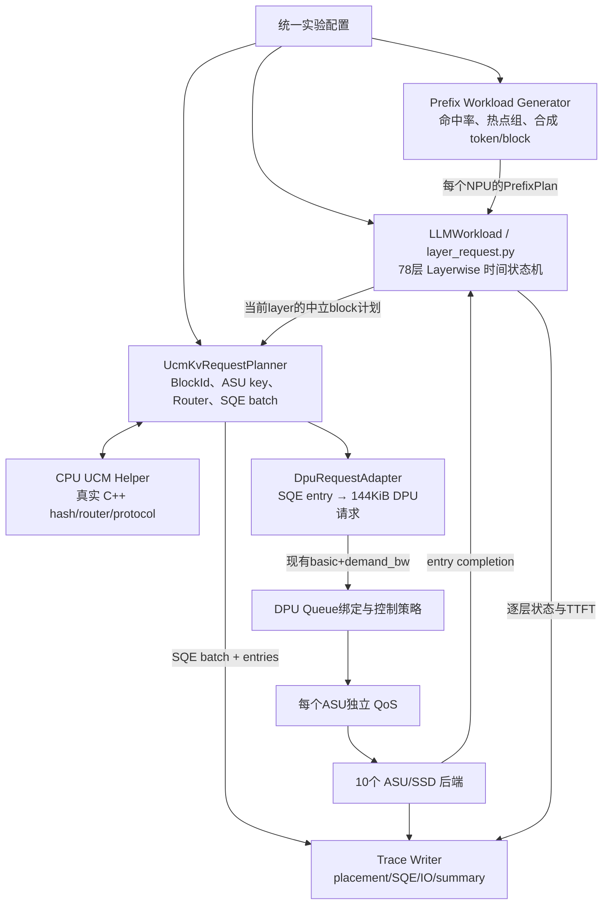
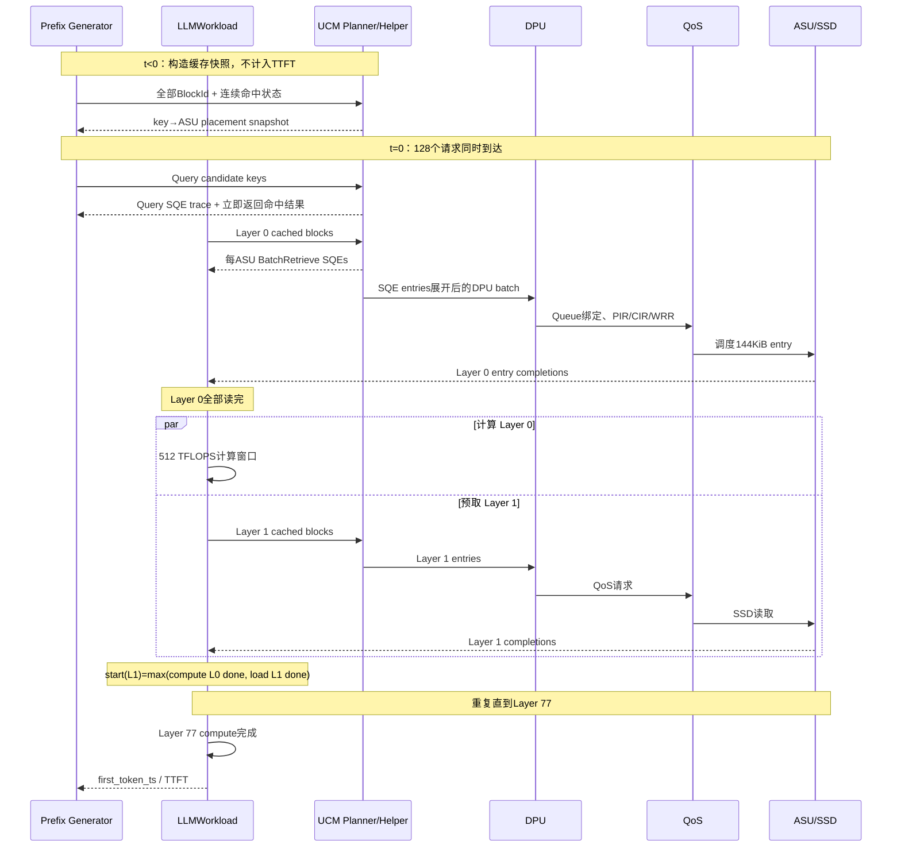

# UCM Layerwise Prefix TTFT 与 QoS 联合仿真设计

> 文档状态：设计对齐稿，尚未开始实现
>
> 面向读者：UCM、LLM KV Cache、DPU/QoS 或离散事件仿真的初学者与实现者
>
> 更新时间：2026-08-16
>
> UCM 基线：`feature_26h1`，commit `e55ddc0ab30770e757fd15c4335dd296db72d11b`
>
> QoS 基线：当前仓库工作树

本文定义一个不依赖真实 NPU、ASU、CANN 或 vLLM 的联合仿真方案。它使用
GLM-5.1 的 Prefix 工作负载模型驱动 UCM 的真实 key 路由和 KV SQE 组织逻辑，
再把 SQE 中的 KV 数据 entry 转换为当前 DPU/QoS/SSD 仿真器能够消费的 IO，
最终计算 128 个 NPU 在 10 个 ASU 下的 Layerwise Prefix TTFT。

KV 语义、UCM SQE 与传统 NVMe IO 的背景知识见
[`KV语义教程.md`](KV语义教程.md)。本文重点回答两个工程问题：

1. UCM 模块与当前 QoS 项目应如何分层、如何连接；
2. 哪些结果来自真实 UCM 代码，哪些只是无硬件环境下的仿真假设。

---

## 目录

1. [一页结论](#1-一页结论)
2. [最终目标与研究问题](#2-最终目标与研究问题)
3. [范围、非目标与结果口径](#3-范围非目标与结果口径)
4. [当前已对齐的实验场景](#4-当前已对齐的实验场景)
5. [三个 Prefix 参数的严格定义](#5-三个-prefix-参数的严格定义)
6. [100K 输入对应的派生数据量](#6-100k-输入对应的派生数据量)
7. [总体分层与组件边界](#7-总体分层与组件边界)
8. [两个项目各自负责什么](#8-两个项目各自负责什么)
9. [Prefix、命中状态与 UCM key 如何生成](#9-prefix命中状态与-ucm-key-如何生成)
10. [为什么保留 layer_request.py](#10-为什么保留-layer_requestpy)
11. [为什么不能直接删除 kv_placement_manager.py](#11-为什么不能直接删除-kv_placement_managerpy)
12. [CPU UCM Adapter 的设计](#12-cpu-ucm-adapter-的设计)
13. [UCM 路由、分组和 SQE 生成](#13-ucm-路由分组和-sqe-生成)
14. [SQE 如何转换为 DPU/QoS 输入](#14-sqe-如何转换为-dpuqos-输入)
15. [Layerwise 离散事件与 TTFT](#15-layerwise-离散事件与-ttft)
16. [完整端到端事件序列](#16-完整端到端事件序列)
17. [Trace 数据模型](#17-trace-数据模型)
18. [建议配置结构](#18-建议配置结构)
19. [计划修改或新增的文件](#19-计划修改或新增的文件)
20. [验证方法与关键不变量](#20-验证方法与关键不变量)
21. [实验矩阵与输出指标](#21-实验矩阵与输出指标)
22. [分阶段实施计划](#22-分阶段实施计划)
23. [已知限制与风险](#23-已知限制与风险)
24. [仍需对齐但不阻塞实现的默认值](#24-仍需对齐但不阻塞实现的默认值)
25. [术语表与源码导航](#25-术语表与源码导航)

---

## 1. 一页结论

### 1.1 最终要构建什么

最终产物是一个闭环离散事件仿真器：

```text
合成 GLM-5.1 Prefix 请求
  → 生成连续命中状态和稳定 UCM block key
  → 使用 UCM 的真实 key 压缩与 Ring Hash 决定目标 ASU
  → 按目标 ASU 分组并生成 Query / BatchRetrieve SQE
  → 将 Retrieve SQE 的每个 entry 展开成 144 KiB QoS IO
  → 经过现有 DPU、QoS、SSD 模型排队和完成
  → completion 回到 Layerwise LLM 状态机
  → 计算每个 NPU 的 Prefix TTFT
```

它同时输出：

- 哪个 NPU 在什么仿真时刻产生了哪条 SQE；
- SQE 发往哪个 ASU；
- SQE 中有哪些 key、layer、offset 和 length；
- SQE entry 如何映射到 DPU/QoS 请求；
- 每个 ASU 的请求数、字节数、热点程度和排队时间；
- 每个 NPU 的逐层读取、计算、stall 和最终 TTFT。

### 1.2 核心架构决策

保留 [`llm_workload/layer_request.py`](../llm_workload/layer_request.py) 作为
Layerwise 计算与 TTFT 状态机，但不把完整 UCM runtime 嵌入其中。

在 `layer_request.py` 与 DPU 之间增加两个边界清楚的模块：

1. `UcmKvRequestPlanner`：负责 UCM key、ASU 路由、SQE 分组与打包；
2. `DpuRequestAdapter`：负责把 SQE entry 转为当前 DPU/QoS 请求，并计算
   每个 ASU path 的聚合带宽需求。

当前 [`llm_workload/kv_placement_manager.py`](../llm_workload/kv_placement_manager.py)
不会被整体删除。它的“随机选择 SSD”部分被可插拔的 UCM backend 替换，
但“按目标存储聚合字节并生成 DPU 元数据”部分继续保留。

### 1.3 为什么不使用 vLLM

本实验不研究 vLLM 的 batching、抢占、chunked prefill 或实际模型执行，
而是研究给定 Prefix 工作负载下的 UCM 放置、读取 SQE 和 QoS 结果。

已明确给出的输入长度、命中率、热点比例、Layerwise 模式和 NPU 性能模型
足以构造这类工作负载。因此第一版不下载、不运行也不模拟 vLLM Scheduler。

### 1.4 为什么不运行完整 UCM ASU client

当前 UCM 的完整 ASU target 强制依赖 Ascend ACL/CANN；本机没有该环境。
但是以下逻辑本身是纯 CPU 的：

- 16-byte BlockId 到 8-byte ASU key 的转换；
- Ring Hash / Maglev Router；
- 按 ASU 分组和连续切批；
- KV Query / BatchRetrieve SQE 的协议打包。

因此增加一个纯 CPU 的 UCM helper，只复用上述真实代码，不初始化 NPU、
连接、注册内存或真实 ASU。

### 1.5 最重要的粒度决策

UCM trace 保持真实 SQE 批次；QoS 继续使用一个 entry 一个 IO：

```text
一条 BatchRetrieve SQE
  ├─ entry 0：144 KiB → 一个 QoS IO
  ├─ entry 1：144 KiB → 一个 QoS IO
  └─ ... 最多 110 个 entry
```

不能把整条 SQE 当成一个 QoS IO。满批 SQE 代表约 15.47 MiB KV 数据，
会破坏当前 `queue_max_io_size_bytes=147456`、Queue depth 和 Utility+EDF
剩余服务量的语义。

---

## 2. 最终目标与研究问题

### 2.1 最终目标

在没有真实 NPU 和 ASU 的电脑上，对于一组参数化的 GLM-5.1 Prefix 请求，
复现以下因果链：

```text
Prefix 内容和缓存状态
  → UCM block key
  → 目标 ASU
  → 每个 ASU 收到的有序 entry
  → Query / BatchRetrieve SQE
  → DPU Queue 和 QoS 调度
  → SSD 完成时间
  → Layerwise 计算与预取重叠
  → Prefix TTFT
```

最终 trace 要能够直接服务当前 QoS 项目中的 DPU、QoS、SSD 和 TTFT 分析，
也要能单独检查 UCM SQE 字段和 ASU 分布。

### 2.2 要回答的主要问题

#### 问题 A：数据为什么存到某个 ASU

需要使用 UCM 真实 key 路径回答：

```text
合成 token block
  → UCM 16-byte chained block hash
  → C++ std::hash 压缩为 8-byte ASU key
  → CRC32 Ring Hash
  → ASU owner
```

不能用当前 QoS 项目的随机放置冒充 UCM 路由。

#### 问题 B：读取时如何组织流量

要区分两层：

1. UCM 层：按目标 ASU 过滤 entry、保持 ASU 内原始次序、最多 110 项切成
   BatchRetrieve SQE；
2. DPU/QoS 层：对进入每个 ASU/SSD path 的 entry 做 Queue 绑定、限速、
   Baseline 或 Utility+EDF 调度。

当前 UCM Router 本身没有根据 ASU 带宽或排队深度动态迁移 key。流量优化主要
发生在已经确定目标 ASU 之后的 DPU/QoS 层。

#### 问题 C：最终会形成什么 SQE

要同时输出：

- SQE opcode、CID、batch number 和 raw dwords；
- 每个 entry 的 key、offset、length、模拟 device address 和 MR key；
- SQE 所属 NPU、layer、目标 ASU 和仿真时刻；
- SQE entry 到 QoS `request_id` 的映射。

#### 问题 D：这些行为如何影响 TTFT

要计算：

- Layer 0 首次读取等待；
- 计算 Layer L 时预取 Layer L+1；
- 各 ASU 并行读取的最慢 completion；
- QoS 排队导致的逐层 SSD stall；
- 最后一层计算完成的首 Token 时刻。

---

## 3. 范围、非目标与结果口径

### 3.1 第一版包含的内容

- GLM-5.1 MLA KV 几何；
- 128 个独立 NPU replica；
- 10 个静态 ASU，默认一 ASU 对应一个模拟 SSD；
- 固定 100K token 输入；
- Prefix 连续命中率、共享热点和独立冷 Prefix；
- UCM Query 和 Layerwise BatchRetrieve SQE；
- UCM 默认 Ring Hash 与真实 SQE pack；
- 现有 DPU、Baseline、Utility+EDF、QoS 和 SSD 后端；
- 完整 78 层的 Prefix TTFT；
- semantic trace、raw SQE trace 和 QoS sidecar。

### 3.2 第一版明确不包含的内容

- vLLM Scheduler；
- GLM-5.1 权重加载或真实文本生成；
- Decode、MTP、采样和后续 token；
- NPU kernel、通信和真实硬件抖动；
- UB、RDMA、PCIe 等数据通道协议；
- ASU 到 NPU 的额外传输时间；
- Prefill 新 KV 的 Store 写回和 SSD 写路径；
- HBM 容量、淘汰和本地 HBM prefix hit；
- ASU membership 动态变化、迁移、副本或失败重试；
- ASU 内部“一台 ASU 多块 SSD”的映射；
- 真实 device address、MR key 或 response buffer；
- 真实多线程下跨 ASU 的全局提交顺序。

### 3.3 “真实”与“仿真”的边界

| 内容 | 口径 |
|---|---|
| Prefix workload | 参数化合成 |
| NPU 计算时间 | 使用 QoS 项目现有 512 TFLOPS 公式 |
| 16-byte UCM BlockId | 使用 UCM 相同链式 hash 语义生成 |
| 16→8-byte ASU key | 复用 UCM C++ `std::hash<string_view>` |
| key→ASU | 复用 UCM Router |
| SQE 分组、上限和协议字段 | 复用 UCM 代码 |
| device address / MR key | 确定性模拟值 |
| Query latency | 0 us 假设 |
| ASU→HBM 传输 | SSD completion 后瞬时到达 |
| SSD 排队和完成 | 当前 QoS/ASU SSD 离散事件模型 |
| TTFT | 在上述假设下的仿真值，不是硬件实测 |

---

## 4. 当前已对齐的实验场景

参数状态分为：

- **已确认**：对话中已经明确；
- **设计推导**：由已确认条件和当前代码直接得到；
- **建议默认**：不影响总体架构，可在配置中调整；
- **待最终确认**：会改变精确结果，但有可执行默认值。

| 参数 | 当前值 | 状态 | 说明 |
|---|---:|---|---|
| 模型 | GLM-5.1 | 已确认 | 只模拟 Prefix Prefill |
| UCM hash中的model identifier | `zai-org/GLM-5.1` | 建议默认/待对齐 | 精确字符串会改变全部BlockId |
| UCM hash中的dtype repr | `torch.bfloat16` | 建议默认/待对齐 | 与真实vLLM配置字符串对齐 |
| 模式 | Layerwise | 已确认 | L0 先读，计算 L 时预取 L+1 |
| Decode | 关闭 | 已确认 | TTFT 后停止 |
| NPU 数 | 128 | 已确认 | 每张 NPU 有完整模型 |
| 并行语义 | TP=1、DP=128、PP=1 | 设计推导 | 每个 NPU 是独立 replica |
| ASU 数 | 10 | 已确认 | 静态 membership |
| ASU→SSD | 1:1 | 建议默认 | `ASU i → SSD i` |
| 输入长度 | 100,000 tokens | 当前实验默认 | 可改为参数扫描 |
| 每 NPU 请求数 | 1 | 建议默认 | 第一版总计 128 个请求 |
| 请求到达 | 全部 t=0 | 建议默认 | 构造最大并发热点 |
| NPU 有效算力 | 512 TFLOPS/NPU | 已确认 | 沿用当前 QoS 公式 |
| 模型层数 | 78 | 设计推导 | Layer 0～77 |
| active parameters | 40B | 设计推导 | 沿用现有 GLM-5.1 profile |
| KV block | 128 tokens | 建议默认/仓库推荐 | UCM 文档推荐值 |
| KV dtype | 16 bit | 建议默认 | BF16/FP16 对本仿真字节数相同 |
| 每层每 block | 147,456 Byte | 设计推导 | 144 KiB |
| 共享热点 NPU 比例 | 0.60 | 已确认 | 128×0.60 四舍五入为 77 |
| 热点长度比例 | 0.50 | 当前设计解释 | 本稿解释为相对整个输入长度，见下文的可选语义 |
| 总缓存命中率 | [0.70, 0.99] | 已确认范围 | 每 NPU 一个值 |
| 命中率分布 | uniform | 建议默认 | 固定 seed，策略间配对 |
| Query latency | 0 us | 已确认方案 | Query 仍写 trace |
| 数据链路延迟 | 0 us | 已确认 | SSD 完成即 HBM 可用 |
| Store during Prefill | false | 已确认方案 | read-only TTFT |
| Router | RING_HASH | 建议默认/当前默认 | 128 virtual nodes |
| ASU IDs | 0～9 | 待最终确认 | ID 会改变精确 hash 落点 |
| SSD 读带宽 | 40 GB/s/SSD | 当前 QoS 配置 | 10 块盘独立 |
| NAND 模式 | TLC 50 us | 当前 QoS 配置 | 沿用现有后端 |
| QoS 策略 | Baseline + Utility+EDF | 建议默认 | 完全相同 workload 配对 |

---

## 5. 三个 Prefix 参数的严格定义

三个比例控制三个相互独立的维度，不能互相替代。

### 5.1 `same_prefix_npu_ratio`

```yaml
same_prefix_npu_ratio: 0.60
```

它控制有多少 NPU 的请求属于同一个热点 Prefix 组：

```text
shared_npu_count = round(128 × 0.60) = 77
```

这 77 个请求的热点 block 使用完全相同的 16-byte UCM BlockId，因此同一个
block 在所有请求中会自然路由到同一个 owner ASU。

它不表示“77 个 NPU 的所有数据只访问一个 ASU”。一个 Prefix 有很多 block，
不同 block 可以落在不同 ASU；它表示同一个 block 的 77 份并发读取会重复访问
同一个 owner。

### 5.2 `hot_prefix_length_ratio`

```yaml
hot_prefix_length_ratio: 0.50
```

它控制共享热点占整个输入的长度：

```text
hot_tokens_requested = 100,000 × 0.50 = 50,000 tokens
```

UCM 只处理完整的 128-token block，因此实际共享热点向下对齐为：

```text
hot_blocks = floor(50,000 / 128) = 390
hot_tokens_aligned = 390 × 128 = 49,920 tokens
```

这 390 个 block 在热点组中共享；热点边界之后，各 NPU 的 token 流发生分叉，
其 chained block hash 也随之分叉。

本稿先把 `0.50` 定义为“整个输入的前 50%”，因此 77 个热点 NPU
有一个长度完全相同的共享区间。如果原意是“每个 NPU **已缓存部分**
的前 50%”，应改成另一个显式参数：

```yaml
hot_prefix_reference: cached_prefix
hot_prefix_length_ratio: 0.50
```

这个可选语义会使各 NPU 的热点长度随各自命中率改变；最前面的区间会被
全部 77 个 NPU 共享，后面的区间只被高命中率 NPU 共享，形成逐渐下降的
fanout。两种语义都可以实现，但不能使用同一个未标明参考系的 ratio。

### 5.3 `cached_prefix_length_ratio`

```yaml
cached_prefix_length_ratio:
  distribution: uniform
  min: 0.70
  max: 0.99
```

它控制每个请求总共有多少连续 Prefix block 已存在于 ASU。

对 NPU `i`：

```text
full_blocks = floor(input_tokens / tokens_per_block)
cached_blocks_i = floor(input_tokens × cached_ratio_i / tokens_per_block)
cached_tokens_i = cached_blocks_i × tokens_per_block
recompute_tokens_i = input_tokens - cached_tokens_i
effective_cached_ratio_i = cached_tokens_i / input_tokens
```

命中必须是从 block 0 开始的最长连续 Prefix，不能随机选择中间 block 命中。
结果同时输出采样得到的 `cached_ratio_i` 和 block 向下对齐后的
`effective_cached_ratio_i`，避免把配置比例误当成实际IO比例。

### 5.4 三个参数合在一起的含义

对热点组中的一个请求：

```text
[0, hot_blocks)
    与其他热点 NPU 完全共享，且已缓存

[hot_blocks, cached_blocks_i)
    该请求独有，但也已缓存

[cached_blocks_i, full_blocks)
    未缓存，需要 NPU 重新计算

最后不足一个 block 的 token
    不产生 UCM key，也需要 NPU 重新计算
```

对非热点组中的请求：

```text
[0, cached_blocks_i)
    该请求独有，但已缓存

[cached_blocks_i, full_blocks)
    未缓存，需要 NPU 重新计算
```

### 5.5 参数合法性约束

当 `hot_prefix_reference=input` 时，为了保证热点部分对所有热点
NPU 都是已缓存状态：

```text
0 <= same_prefix_npu_ratio <= 1
0 <= hot_prefix_length_ratio <= cached_prefix_length_ratio.min <= 1
cached_prefix_length_ratio.min <= cached_prefix_length_ratio.max <= 1
```

当前值满足：

```text
0.50 <= 0.70 <= 0.99
```

如果使用 `hot_prefix_reference=cached_prefix`，热点长度需要按每个 NPU 的
`cached_blocks_i` 单独计算，不再使用上述大小关系。

---

## 6. 100K 输入对应的派生数据量

### 6.1 GLM-5.1 MLA KV 大小

当前模型参数：

```text
kv_lora_rank = 512
qk_rope_head_dim = 64
bits_per_element = 16
tokens_per_block = 128
```

单 token、单层 KV 字节数：

```text
(512 + 64) × 16 / 8 = 1,152 Byte
```

单 block、单层 KV 字节数：

```text
1,152 × 128 = 147,456 Byte = 144 KiB
```

一个 token block 跨 78 层的总 KV 字节数：

```text
147,456 × 78 = 11,501,568 Byte
```

### 6.2 完整 block、命中 block 和尾部

100K 输入：

```text
full_blocks = floor(100,000 / 128) = 781
tail_tokens = 100,000 - 781 × 128 = 32
```

缓存命中率下界 70%：

```text
cached_blocks_min = floor(781 × 0.70) = 546
cached_tokens_min = 69,888
recompute_tokens_max = 30,112
```

缓存命中率上界 99%：

```text
cached_blocks_max = floor(781 × 0.99) = 773
cached_tokens_max = 98,944
recompute_tokens_min = 1,056
```

### 6.3 每个请求的总读数据量

完整 78 层读数据量范围：

```text
546 × 11,501,568 = 6,279,856,128 Byte
773 × 11,501,568 = 8,890,712,064 Byte
```

因此每个 NPU 的 Prefix Retrieve 数据约为 6.28～8.89 GB。128 个请求同时到达
时，10 个 ASU 会承受大量并发读，热点 key 还会产生重复访问。

### 6.4 仿真规模

只计算 Retrieve entry，完整实验的 IO 数量约为：

```text
最少：128 × 78 × 546 = 5,451,264 entries
最多：128 × 78 × 773 = 7,717,632 entries
```

因此实现必须：

- 缓存 `block_id → asu_key → asu_id`，不能每层重复 hash；
- 流式写 JSONL trace，不能把全部 trace 长期留在内存；
- 允许关闭 raw hex，仅保留 semantic trace；
- 继续使用现有 batched SSD backend。

---

## 7. 总体分层与组件边界



### 7.1 分层原则

1. LLM 层不知道 ASU 和 QoS；
2. UCM 层不知道 DPU 调度算法和 SSD 内部流水线；
3. DPU/QoS 层不重新选择 owner ASU；
4. SSD completion 是 LLM 越过层屏障的唯一数据完成依据；
5. Trace 层保存跨层关联，但不参与调度决策；
6. legacy placement 与 UCM placement 可通过配置切换，已有实验不被静默改变。

---

## 8. 两个项目各自负责什么

### 8.1 QoS 项目是时间与资源模型的 source of truth

QoS 项目负责：

- 128 个 NPU/P-node 的工作负载实例；
- 512 TFLOPS 的 Prefill 重计算时间；
- Layerwise 的计算/预取重叠；
- DPU Queue 绑定和控制策略；
- QoS Token Bucket、WRR、Baseline、Utility+EDF；
- 10 个 SSD 的排队、内部流水线和 completion；
- TTFT、stall、带宽和策略对比指标。

关键现有文件：

| 文件 | 继续承担的职责 |
|---|---|
| [`llm_workload/layer_request.py`](../llm_workload/layer_request.py) | Layerwise 与 TTFT 状态机 |
| [`llm_workload/kv_placement_manager.py`](../llm_workload/kv_placement_manager.py) | 保留 DPU 请求聚合外壳 |
| [`DPU/dispatcher.py`](../DPU/dispatcher.py) | Queue 绑定与批量需求登记 |
| [`qos_ssd_simulator.py`](../qos_ssd_simulator.py) | 全局事件编排 |
| [`backends/asu_ssd/`](../backends/asu_ssd/) | SSD 离散事件完成时间 |

### 8.2 UCM 项目是 key、路由和 SQE 的 source of truth

UCM 项目负责：

- vLLM/UCM 风格的 16-byte block identity；
- 16-byte BlockId 到 8-byte ASU key；
- Router 类型、虚拟节点和 ASU owner；
- entry 在每个 ASU 内的相对顺序；
- Query/Retrieve 的切批上限；
- SQE header、entry 字段和 raw dword 编码。

UCM 源码基线固定为：

```text
https://github.com/ModelEngine-Group/unified-cache-management
feature_26h1@e55ddc0ab30770e757fd15c4335dd296db72d11b
```

必须记录 commit、编译器、libstdc++ 和端序，因为当前 16→8-byte key 转换
使用 `std::hash<string_view>`，其结果不是跨所有实现稳定的协议。

### 8.3 明确不交叉的职责

| 问题 | 负责模块 |
|---|---|
| 哪些 Prefix block 已缓存 | Prefix Workload Generator |
| 一个 block 的 key 是什么 | UCM key 逻辑 |
| key 属于哪个 ASU | UCM Router |
| 哪个 ASU Queue 先下发 | DPU/QoS |
| SSD 什么时候完成 | ASU SSD backend |
| 下一层什么时候开始 | LLMWorkload |
| 哪些字段是模拟地址 | Trace metadata |

---

## 9. Prefix、命中状态与 UCM key 如何生成

### 9.1 为什么不能只给 block 一个随机 ASU

热点实验要求同一 Prefix block 在多个 NPU 上产生相同 key，并且同一个 key 在
所有 78 层都选择相同 owner ASU。当前 QoS 的 `request_id` 包含 GPU、layer 和
block index，不能直接当 UCM key。

必须分开两个身份：

```text
request_id
    一次具体的 layer-block IO，必须全局唯一，用于 completion

ucm_block_id
    一个 token-prefix block 的稳定内容身份，跨layer不变，可被多个NPU共享
```

### 9.2 合成 token/block 规则

不需要生成有语言意义的文本，只需要确定性的 token ID 序列。

建议：

1. 用固定 seed 选择 77 个热点 NPU；
2. 为热点 Prefix 创建一条 canonical token 序列；
3. 热点组前 390 个完整 block 使用 canonical token；
4. 热点边界后，在 `(npu_id, block_index, seed)` 上派生独立 token；
5. 非热点组从 block 0 开始使用独立 token；
6. 对 token blocks 使用与 UCM Connector 一致的 chained hash。

热点 NPU 不应简单取 `P0～P76`，否则可能与 Queue/Group 编号产生位置偏差。
建议使用固定 seed 的确定性打乱，且 Baseline 与 Utility+EDF 使用完全相同成员。

### 9.3 Chained Prefix hash

当前 UCM Connector 不是对 token 做一个任意 hash，而是使用带模型元数据的
链式 MD5。等价逻辑为：

```python
meta = f"{model_identifier}:{tensor_parallel_size}:{dtype_repr}:{rank_id}"
meta_bytes = meta.encode("utf-8")

def request_hash(value):
    if isinstance(value, bytes):
        value_bytes = value
    else:
        value_bytes = pickle.dumps(value, protocol=pickle.HIGHEST_PROTOCOL)
    return md5(meta_bytes + value_bytes).digest()

parent = request_hash("UCM_HASH_SEED")

for block_token_ids in full_token_blocks:
    block_id = request_hash((parent, tuple(token_ids_of_this_block)))
    parent = block_id
```

对本实验的 MLA、TP=1 语义，`rank_id=0`。但 `model_identifier` 必须是一个
精确字符串：`zai-org/GLM-5.1`、`/models/GLM-5.1-w4a8` 和 `GLM-5.1`
会生成完全不同的 BlockId，进而改变所有 ASU 映射。`dtype_repr` 也必须记录
实际字符串表示，例如 `torch.bfloat16`。

第一版建议在 QoS 项目中实现一个独立、无 vLLM 依赖的
`UcmBlockIdGenerator`，逐行对齐上述 UCM Python 语义，并与固定的 UCM golden
vector 交叉验证。由于 `pickle.HIGHEST_PROTOCOL` 可随 Python 版本演进，trace
metadata 还必须记录 Python 版本和 pickle protocol。

因此一旦两个请求在某个 block 分叉，后续即使 token 内容再次相同，其 key 也会
继续不同。这正好表达 Prefix cache 的内容身份。

### 9.4 初始化缓存状态

第一版不模拟真实 Store，而是在 `t=0` 前构造缓存快照：

```text
对每个请求：
    生成全部781个完整block key
    前 cached_blocks_i 个标记为存在
    其余标记为不存在

对共享热点：
    相同key只在全局缓存快照中存一份
```

每个存在的 key 仍通过真实 UCM Router 决定 ASU，输出
`placement_snapshot.jsonl`。这回答“数据被放在哪个 ASU”，但初始化放置不消耗
TTFT 时间，也不向 QoS 注入写 IO。

这个 snapshot 不是随机造出的：对同一 key 和同一 ASU membership，UCM 的
BatchStore、Exist/Query 和 BatchRetrieve 走同一 Router，因此 snapshot 中的
owner 就是预先执行 Store 时会选中的 owner，后续 Query/Retrieve 也会回到
该 ASU。第一版只省略 Store 的运行时间和写 SQE，不省略它的放置结果。

### 9.5 Query 结果必须连续

Query 会检查 candidate block 是否存在，Prefix 命中长度取从 block 0 开始的
最长连续成功区间。

仿真不能随机挑 70% block 标记命中；必须构造：

```text
[hit, hit, hit, ..., hit, miss, miss, ...]
```

这样配置命中率、Query SQE、Retrieve block 和 Prefill 重计算 token 才相互一致。

---

## 10. 为什么保留 layer_request.py

### 10.1 它已经实现了需要的 Layerwise 状态机

当前 `LLMWorkload` 已经表达：

```text
先读取 Layer 0
  → 计算 Layer 0，同时预取 Layer 1
  → 取 max(计算完成, Layer 1读完)
  → 计算 Layer 1，同时预取 Layer 2
  → ...
  → 最后一层计算完成，产生首Token
```

它还已经完成：

- 每张 NPU 独立状态；
- 每层 pending IO 集合；
- 多 SSD completion 屏障；
- SSD stall 统计；
- 最后一层 TTFT；
- DPU 所需的 inference arrival、service window 和 layer index。

这些行为正是本实验需要的，不应重写。

### 10.2 需要修改的部分

`layer_request.py` 只做以下小范围修改：

1. 从 `PrefixPlan` 读取 block identity 和每 NPU 命中 block 数；
2. 缓存长度按完整 block 向下对齐，而不是生成部分 block IO；
3. block 输出增加 `ucm_block_id`、`token_block_index` 和 `layer_index`；
4. `request_id` 继续包含 inference、NPU、layer、block，保证 completion 唯一；
5. 运行完整 Layer 0～77；
6. 继续使用现有 512 TFLOPS 重计算公式。

### 10.3 NPU 计算时间公式

沿用当前代码口径：

```text
active_parameters_per_layer = 40B / 78

layer_operations_i =
    active_parameters_per_layer
    × recompute_tokens_i
    × operation_factor_per_parameter_token

compute_time_i = layer_operations_i / 512 TFLOPS
```

当前 `operation_factor_per_parameter_token=2`。这是一种有效算力近似，不是
GLM-5.1 的逐 kernel 实测曲线，但已被选作本实验的 NPU 性能模型。

热点比例只影响 key 重复和 ASU 排队，不直接改变某个请求的计算量；该请求的
计算量由自己的 `cached_prefix_length_ratio` 决定。

---

## 11. 为什么不能直接删除 kv_placement_manager.py

### 11.1 当前文件承担了两个职责

当前 `KVPlacementManager`：

1. 为每个 block 选择 `storage_target_id`；
2. 汇总同一层、同一目标 SSD 的总字节数，并生成 DPU 的 `demand_bw`。

第一个职责必须换成 UCM Router；第二个职责仍然正确且必需。

### 11.2 建议改成 Facade + Backend

```text
KVPlacementManager / DpuRequestAdapter
  ├─ LegacyPlacementBackend
  │    保留现有 random / round-robin 实验
  └─ UcmPlacementBackend
       使用 UCM block key 和目标 ASU
```

建议配置：

```yaml
placement:
  backend: ucm
```

旧实验可继续使用：

```yaml
placement:
  backend: legacy
  strategy: random
```

### 11.3 建议返回显式 LayerSubmission

避免通过隐藏副作用写 trace，建议 planner 返回：

```python
LayerSubmission(
    dpu_requests=[...],
    sqe_batches=[...],
    placement_records=[...],
)
```

`JointSimulation` 做两件明确的事：

1. 把 `sqe_batches` 交给 trace writer；
2. 把 `dpu_requests` 交给现有 `DPURequestGateway.submit_batch()`。

completion 路径不变。

---

## 12. CPU UCM Adapter 的设计

### 12.1 选择方案

推荐在 UCM 仓库新增一个长驻的纯 CPU helper：

```text
ucm-kv-trace-helper
```

QoS Python 进程通过 JSONL stdin/stdout 或稳定 C ABI 与它通信。第一版优先
使用长驻 CLI，原因是：

- 不需要 pybind11；
- 与 Python 环境隔离；
- 便于记录 commit 和 toolchain；
- 不需要每个 layer 重新启动进程；
- 能直接调用 UCM C++ 类型和协议 pack。

### 12.2 为什么不用完整 AsuClient

完整 ASU target 的 CMake 当前强制：

```text
RUNTIME_ENVIRONMENT=ascend
acl/acl.h
libascendcl
```

本机没有这些依赖。即使使用 FAKE provider，部分路径仍初始化 ACL 和操作 device
memory，因此不能把它当纯 CPU 仿真器。

### 12.3 helper 真实复用的代码

helper 应直接编译或链接以下纯 CPU 逻辑：

- `ucm/transport/kv/common/src/router.cpp`；
- 16-byte `BlockIdHasher` / `MakeAsuKey` 等价代码；
- `IoScheduler` 的 Query/Retrieve split 规则；
- `ucm/transport/kv/asu/trans/src/kv_protocol.cpp`；
- Query 与 BatchRetrieve request 构造所需的最小代码。

不能复制为一份无人维护的 Python 版本。

### 12.4 helper 不执行的行为

- 不建立真实 connection/QP；
- 不注册内存；
- 不发送 UB 包；
- 不等待 CQE；
- 不调用 ACL；
- 不模拟 ASU 服务时间；
- 不决定 DPU/QoS 策略。

### 12.5 helper 接口草案

初始化：

```json
{
  "command": "init",
  "ucm_commit": "e55ddc0ab30770e757fd15c4335dd296db72d11b",
  "asu_ids": [0, 1, 2, 3, 4, 5, 6, 7, 8, 9],
  "router": {"type": "RING_HASH", "virtual_nodes": 128},
  "kv_ns_id": 100
}
```

路由并打包：

```json
{
  "command": "route_and_pack",
  "opcode": "BatchRetrieve",
  "npu_id": 17,
  "layer_index": 4,
  "sim_ready_time_us": 12345.0,
  "entries": [
    {
      "request_id": "run0:P17:L4:B00012",
      "block_id_hex": "00112233445566778899aabbccddeeff",
      "offset_bytes": 589824,
      "length_bytes": 147456,
      "device_addr": 281474976710656,
      "mr_key": 65537
    }
  ]
}
```

返回：

```json
{
  "asu_batches": [
    {
      "target_asu_id": 3,
      "asu_local_sequence": 57,
      "cid": 18,
      "opcode": "BatchRetrieve",
      "batch_number": 1,
      "descriptor_bytes": 100,
      "payload_bytes": 147456,
      "sqe_dwords": [0, 0],
      "entries": [
        {
          "request_id": "run0:P17:L4:B00012",
          "asu_key_hex": "...",
          "length_bytes": 147456
        }
      ]
    }
  ]
}
```

示例中的 `sqe_dwords` 只是结构占位；真实实现返回完整 dword 数组或 little-endian
hex。

### 12.6 toolchain 元数据

helper 每次运行必须输出：

```text
UCM commit
C++ compiler/version
libstdc++ version
endianness
sizeof(size_t)
router config
ASU IDs
```

这是因为 `std::hash<string_view>` 和 native `memcpy` 形成的 8-byte key 不是跨
所有平台保证一致。仿真可复现性必须绑定 toolchain。

---

## 13. UCM 路由、分组和 SQE 生成

### 13.1 16-byte BlockId 到 8-byte ASU key

UCM ASU Store 当前执行：

```text
16-byte BlockId
  → std::hash<string_view>
  → uint64
  → native-endian memcpy
  → 8-byte ASU CacheKey
```

不能使用 Python `hash()`；它不仅算法不同，还会受进程随机化影响。

### 13.2 默认 Ring Hash

默认路由：

```text
ASU IDs = [0..9]
virtual nodes per ASU = 128
hash = CRC32 IEEE
```

每个 key 恰好选择一个 owner ASU，无副本、无负载反馈和读取 fallback。

同一个 key 在相同 membership 下，Query 和 Retrieve 必须选择同一个 ASU。

### 13.3 ASU ID 是输入，不只是显示标签

虚拟节点 key 中包含数值 ASU ID，因此：

```text
[0,1,...,9]
```

与：

```text
[1,2,...,10]
```

会产生不同的精确映射。没有生产环境 ID 时使用 `[0..9]`，并把它写入 trace
metadata。

### 13.4 一个 block 在不同层如何成为 entry

同一个 token block 在 78 层中使用同一个 16-byte BlockId 和同一个
8-byte ASU key；Layer 不进入 owner key，而是作为 shard index 改变读取
offset：

```text
entry.key       = MakeAsuKey(block_id)
entry.offset    = layer_index × 147,456
entry.length    = 147,456
entry.addr      = deterministic synthetic HBM address
entry.mr_key    = deterministic synthetic MR key
```

因此对某个 block，Layer 0～77 都访问同一个 owner ASU，只是 offset 从
0 增长到 `77 × 147,456`。`device_addr` 和 `mr_key` 只为了生成可通过
UCM protocol validation 的 raw SQE，不参与路由和 QoS 资源计算。

### 13.5 按 ASU 分组

对一次 layer load 的有序 entries：

```text
for entry in original_order:
    asu = router(entry.key)
    append entry to bucket[asu]
```

同一个 ASU bucket 内保持原始 block 顺序。

### 13.6 Query/Exist 的边界

每个请求在到达时只执行一次 Prefix Query，查询该请求的全部完整候选
block：

```text
128个NPU × 每个请求781个key = 99,968个Query key entries
```

Query 覆盖全部 781 个 key，而不是只覆盖最终命中的 546～773 个 key。
返回结果才决定从 block 0 开始的最长连续命中长度。

Query keys 也先按 owner ASU 分组，每个 ASU bucket 按原始 block 顺序连续
切分：

```text
Exist SQE：每条最多256个key
raw descriptor bytes = 64 + 16 × batch_number
```

第一版中 Query latency 为 0，不注入 DPU/QoS/SSD，但 Exist SQE 仍完整写入
trace。Query 是整个请求一次，不是每一层重复一次。

### 13.7 BatchRetrieve SQE 切分

每个 ASU bucket 连续切分：

```text
entries[0:110]     → SQE 0
entries[110:220]   → SQE 1
...
```

BatchRetrieve 每条 SQE 最多 110 个 entry。raw descriptor 大小为：

```text
64 Byte header + batch_number × 36 Byte
```

注意这只是命令描述符大小；QoS/SSD 读取数据量是：

```text
sum(entry.length)
```

不能用 descriptor bytes 代替 KV payload bytes。

### 13.8 CID 和顺序

CID 在每个模拟 `(NPU client, ASU transport)` 流内递增，使用 16 bit 语义，跳过
0 并允许回绕。CID 不是全局 request ID。

当前 UCM 跨 ASU bucket 使用独立 transport，且 bucket 容器没有稳定全局遍历
语义。因此 trace 定义：

- 保证每个 `(npu_id, asu_id)` 的 `asu_local_sequence`；
- 不宣称存在真实跨 ASU 全序；
- 为离散事件复现增加一个仅用于仿真的 deterministic tie-breaker：
  `(sim_ts, npu_id, asu_id, asu_local_sequence, entry_index)`；
- tie-breaker 不解释为生产发送顺序。

### 13.9 目标 ASU 不在 raw SQE 中

目标 ASU 由选择的 transport/connection 隐式表达，不是 SQE dword 字段。
`kv_ns_id` 也不是 ASU ID。

因此每条 trace 必须保存：

```text
target_asu_id + raw_sqe
```

只有 raw bytes 无法恢复目标 ASU。

### 13.10 “读取编排”的真实边界

当前 UCM 在 owner ASU 确定前后没有一个跨 ASU 的负载感知调度器：

- Ring Hash 不读取 ASU Queue depth、带宽或延迟；
- 同一 key 不会因某个 ASU 繁忙而改发到其他 ASU；
- `IoScheduler` 的主要作用是按 256/110 上限连续切批，不排优先级；
- 各 ASU transport 可并行提交，但 UCM 不给这些 ASU 定义一个可依赖的全局先后顺序；
- Layerwise 只决定“哪一层的读在什么时刻 ready”，不改变 key 的 owner。

本联合仿真中的 DPU/QoS 是 owner 已经由 UCM 固定之后的数据面排队与限速模型。
它可以改变同一 ASU 上不同 NPU entry 的 dispatch 顺序，但不得把 entry
重路由到其他 ASU。连接/QP 选择属于本稿明确不模拟的 transport 层。

---

## 14. SQE 如何转换为 DPU/QoS 输入

### 14.1 两种粒度同时存在

| 层级 | 粒度 | 用途 |
|---|---|---|
| UCM trace | 一条 SQE，包含 1～110 entries | 检查协议、分组和发送序列 |
| DPU/QoS | 一个 entry 一个 144 KiB IO | 排队、限速、SSD completion |

### 14.2 为什么 QoS 不直接消费整条 SQE

满批 payload：

```text
110 × 147,456 = 16,220,160 Byte ≈ 15.47 MiB
```

当前 QoS/DPU 的关键假设是每个完整 IO 为 147,456 Byte：

- Queue depth 表示剩余完整 KV block 数；
- `queue_max_io_size_bytes=147456`；
- Utility+EDF 使用 `queue_depth × block_size` 估计剩余字节；
- SSD backend 再把一个 144 KiB IO拆成4 KiB命令。

把整条 SQE 当单 IO 会破坏这些不变量。

### 14.3 DPU 请求映射

对每个 Retrieve entry：

```python
{
    "basic": {
        "request_id": "run0:P17:L4:B00012",
        "p_node_id": "P17",
        "storage_target_id": "SSD3",
        "size_bytes": 147456,
    },
    "demand_bw": {
        "demand_group_id": "run0:P17:prefetch:L4",
        "compute_layer_index": 3,
        "prefetch_layer_index": 4,
        "inference_arrival_time_us": 0,
        "service_window_us": 1234,
        "aggregate_bytes_on_storage_target": 12345678,
        "aggregate_required_bytes_per_second": 10000000000,
    },
}
```

映射规则：

| UCM/LLM 字段 | DPU/QoS 字段 |
|---|---|
| NPU ID | `p_node_id=P<npu_id>` |
| target ASU | `storage_target_id=SSD<asu_id>` |
| entry length | `size_bytes` |
| layer read group | `demand_group_id` |
| SQE ready time | `arrival_time_us` |
| 当前计算层时间 | `service_window_us` |

Layer 0 初始读的 `compute_layer_index=None`，它没有可以重叠的前一层计算窗口。
为了保持当前 Utility+EDF 接口和价值评分语义，第一版仍传递正数
`service_window_us=single_layer_compute_time_us`；这个数对 Stage 0 只是控制器评分
参数，**不表示 Layer 0 读取可以被计算隐藏**。Layer 0 的全部实际读取时间
仍进入 TTFT，并在结果中单独报告。

### 14.4 每个 ASU path 的聚合需求

保留当前 `KVPlacementManager` 的两遍聚合逻辑：

```text
path_bytes[asu] = sum(entry.length for entries routed to asu)

required_Bps[asu] =
    ceil(path_bytes[asu] × 1,000,000 / service_window_us)
```

同一 demand group 在不同 ASU 上并行，层读取完成时间取最慢 ASU 的最后一个
entry completion，不把不同 ASU 的时间相加。

### 14.5 Sidecar 关联

每个 DPU request 额外在 sidecar 中关联：

```text
request_id
  → sqe_uid
  → entry_index
  → ucm_block_id
  → asu_key
  → target_asu_id
```

DPU 仍只消费原有六字段/聚合字段，不需要理解 UCM 协议。

---

## 15. Layerwise 离散事件与 TTFT

### 15.1 时间定义

| 时间 | 含义 |
|---|---|
| `inference_arrival_ts` | 整个 Prefix 请求进入系统 |
| `query_ready_ts` | Query SQE 生成时间，第一版等于 arrival |
| `sqe_ready_ts` | 某层 Retrieve SQE 进入 DPU/QoS 的时间 |
| `qos_dispatch_ts` | 单个 entry 离开 QoS、进入 SSD 的时间 |
| `ssd_complete_ts` | SSD 完成单个 entry 的时间 |
| `layer_load_done_ts` | 当前层所有 entry 的最晚 completion |
| `layer_compute_start_ts` | 当前层真正开始计算的时间 |
| `layer_compute_done_ts` | 当前层计算完成时间 |
| `first_token_ts` | 最后一层计算完成时间 |

第一版假设：

```text
kv_hbm_ready_ts = ssd_complete_ts
```

不增加 ASU→NPU 传输时间。

### 15.2 Layerwise 递推

设 `D_L` 为 Layer L 的 KV 全部读完时刻，`S_L` 为 Layer L 计算开始时刻，
`c_i` 为当前 NPU 的单层计算时间。

```text
S_0 = D_0

在 S_L：
    开始计算 Layer L
    同时提交 Layer L+1 Retrieve（若存在）

C_L = S_L + c_i
S_(L+1) = max(C_L, D_(L+1))

TTFT = C_77 - inference_arrival_ts
```

如果下一层读取早于当前层计算结束：

```text
ssd_stall = 0
```

如果下一层读取更晚：

```text
ssd_stall = D_(L+1) - C_L
```

### 15.3 初始 Layer 0

Layer 0 没有前一层计算可以隐藏其 IO：

```text
t=0 Query（零延迟）
t=0 提交 Layer 0 Retrieve
等待全部 Layer 0 entry completion
开始 Layer 0 计算
```

因此 Stage 0 的读取时间完整进入 TTFT。

### 15.4 最后一层

计算 Layer 77 时没有 Layer 78 预取。Layer 77 计算完成即得到本仿真的首 Token
时刻；不继续执行 Decode。

### 15.5 Store 为什么不在第一版中

Prefill 未命中部分计算后，真实 UCM Layerwise connector 可以逐层 Store 新 KV，
并可能在 forward 结束等待 Store 完成。

第一版将 cache hit ratio 作为外部输入，且只研究读取 TTFT，因此：

```text
store_during_prefill = false
```

这意味着：

- 不生成运行阶段 Store SQE；
- 不建立 SSD 写模型；
- 缓存状态不会因本次请求而演化；
- 结果命名为 read-only Prefix TTFT。

---

## 16. 完整端到端事件序列



### 16.1 同一时刻的事件优先级

建议延续当前离散事件口径：

```text
token refill
→ DPU rate update
→ IO arrival
→ QoS scheduler dispatch
→ SSD stage events
→ completion callback
→ 下一层 GPU ready event
```

Query 与 Layer 0 Retrieve 在 `t=0` 时通过显式 phase 排序：Query trace 先记录，
命中结果立即可用，然后生成 Retrieve。

### 16.2 SQE ready 与 SSD dispatch 不能混淆

```text
sqe_ready_ts
    UCM 已经决定目标 ASU 并形成命令

qos_dispatch_ts
    DPU/QoS 允许某个 entry 真正进入 SSD
```

前者回答“UCM 什么时候产生请求”，后者回答“QoS 什么时候让数据 IO 开始服务”。
两者都需要保留。

---

## 17. Trace 数据模型

建议输出一个 trace bundle，而不是单一 CSV。

### 17.1 `metadata.json`

```json
{
  "schema_version": "ucm-prefix-ttft-v1",
  "run_id": "glm51-128npu-10asu-seed6103",
  "ucm_commit": "e55ddc0ab30770e757fd15c4335dd296db72d11b",
  "request_hasher_meta": "zai-org/GLM-5.1:1:torch.bfloat16:0",
  "python_version": "<record-at-runtime>",
  "pickle_protocol": "<record-at-runtime>",
  "time_unit": "us",
  "npu_count": 128,
  "asu_ids": [0, 1, 2, 3, 4, 5, 6, 7, 8, 9],
  "router": "RING_HASH",
  "virtual_nodes": 128,
  "raw_address_semantics": "synthetic",
  "transport_latency_us": 0,
  "store_during_prefill": false
}
```

还应记录 compiler、libstdc++、endianness、配置文件 hash 和 QoS 策略。
`request_hasher_meta`、Python 版本和 pickle protocol 用来保证 16-byte BlockId
可重现；C++ toolchain 元数据用来保证 16→8-byte key 可重现。

### 17.2 `placement_snapshot.jsonl`

每个唯一缓存 block 一条：

```json
{
  "block_id_hex": "...",
  "asu_key_hex": "...",
  "target_asu_id": 3,
  "token_block_index": 12,
  "prefix_class": "shared_hot",
  "referencing_npu_count": 77
}
```

它描述 `t=0` 前的初始缓存状态，不是运行阶段 Store trace。

### 17.3 `sqe_trace.jsonl`

每条 SQE 一条：

```json
{
  "sqe_uid": "run0:P17:ASU3:SEQ57",
  "phase": "layer_retrieve",
  "opcode": "BatchRetrieve",
  "sqe_ready_time_us": 12345.0,
  "npu_id": 17,
  "p_node_id": "P17",
  "layer_index": 4,
  "target_asu_id": 3,
  "storage_target_id": "SSD3",
  "asu_local_sequence": 57,
  "cid": 18,
  "kv_ns_id": 100,
  "batch_number": 72,
  "descriptor_bytes": 2656,
  "payload_bytes": 10616832,
  "raw_sqe_hex_le": "...",
  "entries": [
    {
      "entry_index": 0,
      "request_id": "run0:P17:L4:B00012",
      "block_id_hex": "...",
      "asu_key_hex": "...",
      "token_block_index": 12,
      "shard_index": 4,
      "offset_bytes": 589824,
      "length_bytes": 147456,
      "device_addr": 281474976710656,
      "mr_key": 65537,
      "address_semantics": "synthetic"
    }
  ]
}
```

Query SQE 使用相同 envelope，但没有数据 payload，也不进入 DPU/QoS。

### 17.4 `qos_request_sidecar.jsonl`

```json
{
  "request_id": "run0:P17:L4:B00012",
  "sqe_uid": "run0:P17:ASU3:SEQ57",
  "entry_index": 0,
  "dpu_arrival_time_us": 12345.0,
  "qos_queue_id": "q017",
  "qos_dispatch_time_us": 12400.0,
  "ssd_completion_time_us": 12458.0
}
```

### 17.5 `summary.json`

至少包含：

- 每个 NPU 的命中率、热点组身份、compute-only TTFT、SSD stall 和 TTFT；
- 每个 ASU 的 Query/Retrieve SQE 数、entry 数和 payload bytes；
- 每个 ASU 的热点/非热点字节；
- 每个 ASU 的峰值 Queue depth、带宽和完成时间；
- SQE batch size 分布；
- Baseline 与 Utility+EDF 的配对差异；
- 请求数、字节数和 completion 守恒结果。

### 17.6 Trace 级别

由于完整实验有数百万 entries，建议：

```yaml
trace:
  semantic_sqe: true
  raw_sqe: true
  qos_sidecar: true
  compression: gzip
```

性能调试时可设置：

```yaml
trace:
  raw_sqe: false
```

关闭 raw 不应改变任何仿真结果。

---

## 18. 建议配置结构

以下是设计目标，不要求直接覆盖现有配置文件：

```yaml
simulation:
  topology:
    gpu_count: 128
    ssd_counts: [10]
    gpu_id_prefix: NPU
    p_node_id_prefix: P
    storage_target_id_prefix: SSD

  workload_generation:
    mode: ucm_hot_prefix
    inference_count_per_gpu: 1
    random_seed: 6103
    input_tokens: 100000
    arrival_time_us: 0

    same_prefix_npu_ratio: 0.60
    hot_prefix_reference: input
    hot_prefix_length_ratio: 0.50
    cached_prefix_length_ratio:
      distribution: uniform
      min: 0.70
      max: 0.99

  model:
    name: GLM-5.1
    profile:
      active_parameters: 40000000000
      hidden_layers: 78
      kv_lora_rank: 512
      qk_rope_head_dim: 64

    # 参与UCM RequestHasher，任意字符串变化都会改变key和ASU路由。
    ucm_hash_identity:
      model_identifier: zai-org/GLM-5.1
      tensor_parallel_size: 1
      dtype_repr: torch.bfloat16
      rank_id: 0

  gpu:
    device: abstract_npu
    count: 1
    effective_compute_tflops: 512.0
    operation_factor_per_parameter_token: 2.0

  kv_cache:
    bits_per_element: 16
    tokens_per_block: 128

  workload:
    first_layer_index: 0
    last_layer_index: 77
    batch_size: 1

  placement:
    backend: ucm
    asu_ids: [0, 1, 2, 3, 4, 5, 6, 7, 8, 9]
    asu_to_storage_target:
      0: SSD0
      1: SSD1
      2: SSD2
      3: SSD3
      4: SSD4
      5: SSD5
      6: SSD6
      7: SSD7
      8: SSD8
      9: SSD9
    router:
      type: RING_HASH
      virtual_node_count: 128
    kv_ns_id: 100

  ucm_runtime_model:
    query_latency_us: 0
    transport_to_hbm_latency_us: 0
    store_during_prefill: false
    cross_asu_order: concurrent

  trace:
    output_dir: experiments/results/ucm_prefix_ttft
    semantic_sqe: true
    raw_sqe: true
    qos_request_sidecar: true
    compression: gzip

  dpu:
    queue_binding:
      strategy: balanced_exclusive
    rate_control:
      strategies:
        - baseline
        - utility_edf_integer_l750
```

### 18.1 配置校验

启动时必须拒绝：

- `hot_prefix_length_ratio > cached_prefix_length_ratio.min`；
- `npu_count > 每个SSD可用独占Queue数`；
- `len(asu_ids) != 固定SSD数量`；
- UCM backend 下缺失 ASU→SSD 映射；
- block bytes 不是 UCM 512B 对齐；
- full 78-layer 实验仍配置 `last_layer_index=3`；
- raw SQE 开启但 helper metadata 不完整。

---

## 19. 计划修改或新增的文件

具体命名可在实现时微调，职责边界不变。

### 19.1 QoS 项目

| 文件 | 计划 | 说明 |
|---|---|---|
| `config/simulation_config.yaml` 或独立实验配置 | 扩展 | 增加 UCM/hot-prefix 参数，固定10 ASU、78层 |
| `llm_workload/inference_workload_sampler.py` | 扩展 | 增加 `ucm_hot_prefix` sampler |
| `llm_workload/prefix_plan.py` | 新增 | 构造热点成员、token blocks、命中状态和BlockId |
| `llm_workload/layer_request.py` | 小改 | 接收PrefixPlan、完整block对齐、输出稳定key元数据 |
| `llm_workload/kv_placement_manager.py` | 重构 | 保留聚合外壳，接入legacy/ucm backend |
| `llm_workload/ucm_request_planner.py` | 新增 | 调helper、形成SQE与entry映射 |
| `simulation_common/ucm_helper_client.py` | 新增 | 管理长驻helper进程和协议校验 |
| `simulation_common/ucm_trace_writer.py` | 新增 | 流式输出trace bundle |
| `qos_ssd_simulator.py` | 小改 | 初始化UCM planner、处理LayerSubmission和Query trace |
| `DPU/*` | 原则上不改 | 继续消费现有请求契约 |
| `qos/*` | 不改 | 不理解UCM字段 |
| `backends/asu_ssd/*` | 不改 | SSD完成即HBM可用 |

### 19.2 UCM 项目

| 文件/目录 | 计划 | 说明 |
|---|---|---|
| `ucm/transport/kv/tools/trace-helper/` | 新增 | 纯CPU长驻helper |
| `ucm/transport/kv/common/` | 复用 | Router源代码 |
| `ucm/transport/kv/asu/trans/src/kv_protocol.cpp` | 复用/拆出CPU target | SQE pack |
| CMake | 小改 | 新target不进入强制Ascend的`asu/`构建路径 |
| UCM测试 | 新增 | golden vector、路由和SQE验证 |

### 19.3 不建议的实现方式

- 不把 UCM Router 重新写成 Python 并假设结果相同；
- 不把完整 AsuClient 动态库强行 stub 到能链接；
- 不在 DPU/QoS 请求字典中塞入全部 raw SQE 字段；
- 不让 `layer_request.py` 直接调用 subprocess；
- 不删除 legacy placement，导致旧实验结果静默改变；
- 不把一个 SQE 当一个 SSD IO；
- 不用 `request_id` 代替内容 key。

---

## 20. 验证方法与关键不变量

### 20.1 UCM golden tests

CPU helper 必须与 UCM 已有测试向量对齐：

- CRC32 Router owner；
- Ring Hash 128 virtual nodes；
- 16→8-byte ASU key；
- BatchRetrieve header 与 entry dwords；
- 1、109、110、111 entries 的切批边界；
- CID 跳过0和回绕；
- 512B alignment 检查。

### 20.2 Prefix/key 不变量

1. 同一个热点 token block 在77个NPU上产生相同16-byte BlockId；
2. 同一 BlockId 在78层保持不变；
3. 同一 BlockId 的8-byte ASU key保持不变；
4. 相同 membership 下始终路由到同一个ASU；
5. Prefix分叉后的后续BlockId不同；
6. 只有完整128-token block产生key；
7. `cached_blocks_i == floor(input_tokens × cached_ratio_i / 128)`；
8. Query命中是连续Prefix。

### 20.3 SQE 不变量

1. 每个NPU每个请求只生成一轮Query，总Query entry数为781；
2. 每条Exist SQE的 `1 <= batch_number <= 256`，且
   `batch_number == len(keys)`；
3. Query覆盖全部候选block，不是只覆盖命中block；
4. Query entry不转成DPU/QoS IO；
5. 每条Retrieve SQE的 `1 <= batch_number <= 110`；
6. Retrieve `batch_number == len(entries)`；
7. Retrieve descriptor bytes等于 `64 + 36 × batch_number`；
8. Retrieve payload bytes等于所有entry length之和；
9. 同ASU内entry顺序与输入block顺序一致；
10. `target_asu_id`必须存在于sideband；
11. raw SQE中的模拟地址全部非零、对齐并标注synthetic；
12. CID不作为全局唯一request ID。

### 20.4 SQE→QoS 守恒

对每一层、每个NPU、每个ASU：

```text
Retrieve SQE entry 数 == DPU request 数

sum(SQE entry.length) ==
sum(DPU basic.size_bytes) ==
aggregate_bytes_on_storage_target
```

全局：

```text
submitted DPU requests
== SSD completed requests
== LLMWorkload completed requests
```

### 20.5 Layerwise 时间不变量

```text
layer_start[L+1]
== max(layer_compute_done[L], layer_load_done[L+1])

first_token_time
== layer_compute_done[77]

ttft
== first_token_time - inference_arrival_time
```

所有时间必须单调，不允许 completion 或下一层事件回退全局时钟。

### 20.6 策略公平性

Baseline 与 Utility+EDF 必须共享：

- 相同128个请求；
- 相同命中率；
- 相同77个热点NPU；
- 相同UCM keys与ASU placement；
- 相同SQE batch；
- 相同SSD硬件参数；
- 相同初始Queue状态。

两种策略唯一允许不同的是 DPU/QoS 调度决策。

### 20.7 端到端小规模测试

在完整实验前依次运行：

1. 2 NPU × 2 ASU × 2层 × 少量block；
2. 4 NPU × 2 ASU，50%共享热点；
3. 1 NPU × 10 ASU，触发110/111切批；
4. 128 NPU × 10 ASU × 4层 smoke；
5. 128 NPU × 10 ASU × 78层正式实验。

---

## 21. 实验矩阵与输出指标

### 21.1 首个对齐实验

```text
NPU                 128
ASU/SSD             10
请求/NPU            1
到达                 t=0
输入                 100K
命中率               uniform[0.70, 0.99]
共享热点NPU          60%=77
共享热点长度         输入前50%，block对齐后49,920 tokens
模型层               78
NPU算力              512 TFLOPS/NPU
UCM模式              Layerwise read-only
Router               Ring Hash / 128 vnode
数据链路             SSD完成后瞬时到HBM
策略                 Baseline、Utility+EDF
```

### 21.2 建议后续扫描维度

第一版正确后，可分别扫描：

- `same_prefix_npu_ratio`：0、0.25、0.50、0.60、0.75、1.0；
- `hot_prefix_length_ratio`：0.1、0.25、0.5、0.7；
- hit ratio 区间；
- ASU 数：1、2、4、8、10；
- 输入长度：32K、64K、100K、128K、200K；
- Baseline 与不同 DPU 控制策略；
- Ring Hash 与 Maglev；
- 同时到达与分散到达。

一次只改变一个主维度，避免无法解释结果来源。

### 21.3 UCM 指标

- 每个ASU的唯一key数；
- 每个ASU的热点key数；
- 每个ASU的Query/Retrieve SQE数；
- SQE batch number分布；
- 每个ASU的payload bytes；
- 同一个key的并发读取fanout；
- 10个ASU负载的max/mean、标准差和变异系数；
- 每个NPU一次推理访问的不同ASU数。

### 21.4 QoS/SSD 指标

- 每个ASU和Queue的到达、dispatch、completion；
- 峰值/平均Queue depth；
- SSD带宽利用率；
- QoS等待与SSD内部延迟；
- Utility+EDF owner、deadline和stall；
- 热点流量与非热点流量的排队差异。

### 21.5 LLM/TTFT 指标

- 每个NPU的hit ratio和recompute tokens；
- compute-only TTFT；
- Layer 0初始读时间；
- 每层SSD stall；
- 总SSD stall；
- Prefix TTFT的mean、P50、P95、P99、max；
- 热点组与非热点组TTFT；
- Baseline与Utility+EDF的配对差值。

---

## 22. 分阶段实施计划

### Phase 0：冻结配置和 golden contract

产物：

- 本文档确认版；
- 配置schema；
- 2 NPU/2 ASU的小型golden workload；
- semantic SQE和DPU request示例；
- UCM commit/toolchain metadata。

验收：所有参数定义唯一，无“hit ratio既表示NPU比例又表示缓存长度”的歧义。

### Phase 1：PrefixPlan 与 Layerwise 对齐

实现：

- 热点成员；
- 共享/独立token blocks；
- 连续缓存命中；
- block向下对齐；
- `layer_request.py`输出稳定block identity；
- 全78层但暂用legacy placement。

验收：计算量、block数、Layerwise递推和TTFT单元测试通过。

### Phase 2：CPU UCM helper

实现：

- BlockId→ASU key；
- Ring Hash；
- Query/Retrieve分组；
- 110-entry切批；
- raw SQE pack；
- JSONL/C ABI；
- golden vectors。

验收：helper输出与UCM单测逐dword一致；无需ACL即可构建运行。

### Phase 3：QoS adapter 与 trace

实现：

- UCM backend；
- LayerSubmission；
- SQE entry→DPU request；
- placement/SQE/sidecar trace；
- Query零延迟；
- ASU→SSD映射。

验收：entry数、字节、目标ASU和completion全部守恒。

### Phase 4：完整联合仿真

实现：

- 128 NPU；
- 10 ASU；
- 78层；
- Baseline与Utility+EDF配对；
- 完整summary和图表。

验收：无未完成请求、时间单调、两策略workload完全相同、结果可重复。

### Phase 5：可选增强

不属于第一版验收：

- Store与写盘模型；
- Query非零延迟；
- ASU→NPU链路；
- HBM容量和本地hit；
- 多次请求及缓存状态演化；
- vLLM Scheduler前端；
- 动态ASU membership；
- 多ASU/多SSD映射。

---

## 23. 已知限制与风险

### 23.1 NPU性能只是参数模型

512 TFLOPS来自当前QoS配置，不是本机V100或目标NPU上的GLM-5.1逐层实测。
因此结果只能解释为该有效算力假设下的仿真TTFT。
现有公式主要按 `active_parameters × recompute_tokens` 估算，不单独建模随总序列长度
变化的 attention、MoE、collective 或采样开销。

### 23.2 不模拟Store会低估完整UCM请求的TTFT

当前结果明确命名为read-only Prefix TTFT。如果生产connector会等待Store，完整
系统TTFT可能更高。

### 23.3 Query零延迟会低估Stage 0

Query SQE存在于trace，但立即返回。如果未来获得ASU metadata lookup profile，
应把Query completion作为Layer 0 Retrieve前的屏障。

### 23.4 不模拟数据链路

SSD completion即视为HBM可用，因此没有NPU ingress、ASU egress或fabric争用。

### 23.5 C++ hash可移植性

相同源代码在不同标准库/ABI上不保证产生相同8-byte key。trace必须记录toolchain；
不能把本机映射无条件当成所有生产环境的永久协议。

### 23.6 raw SQE不是硬件采集

协议字段布局真实，但地址、MR key、response buffer和墙钟线程交错是模拟值。
raw trace必须标注`synthesis`，不能称为硬件抓包。

### 23.7 跨ASU没有真实全序

每个ASU是独立transport。仿真为同timestamp事件提供确定性tie-breaker，只用于
重放，不能推断生产线程的跨ASU纳秒顺序。

### 23.8 QoS entry粒度忽略SQE命令级开销

第一版保持batch trace，但SSD服务仍按entry模拟，不单独建模SQE decode、命令
原子完成或固件batch开销。

### 23.9 一ASU一SSD是简化

真实ASU内部可能连接多个SSD或有自己的分片。客户端SQE只知道目标ASU，不能从
现有UCM客户端代码推断ASU内部物理盘。第一版将每个ASU直接映射为一个QoS
StoragePath。

### 23.10 完整实验规模较大

数百万IO和完整raw trace可能占用较多时间和磁盘。必须先通过小规模golden，
并支持gzip、semantic-only和分文件输出。

---

## 24. 仍需对齐但不阻塞实现的默认值

以下项目已有默认值；如果没有额外部署信息，可直接按默认实现。

| 项目 | 默认值 | 为什么仍值得记录 |
|---|---|---|
| UCM hash identity | `zai-org/GLM-5.1:1:torch.bfloat16:0` | model/path字符串、dtype、TP或rank任一变化都会改变全部BlockId |
| ASU IDs | `[0,1,...,9]` | ID会改变精确Ring Hash映射 |
| ASU→SSD | 1:1 | 真实ASU内部结构未知 |
| 命中率随机种子 | 6103 | 保证策略配对和重复运行一致 |
| 热点NPU选择 | 固定seed打乱后取77个 | 避免按Queue编号产生位置偏差 |
| 热点长度参考系 | 整个输入的前50% | 若改为“各NPU已缓存部分的前50%”，热点fanout会随命中率变化 |
| Query latency | 0 us | Query仍输出trace |
| Layer 0 `service_window_us` | 单层计算时间 | 仅供Utility评分；初始读无计算重叠，全部进入TTFT |
| raw SQE | 默认开启并gzip | 可因性能关闭，不影响仿真 |
| kv_ns_id | 100 | 不是ASU ID，仅用于形成完整SQE |
| QoS策略 | Baseline + Utility+EDF | 用同一workload做配对比较 |

如果需要复现某个真实部署，必须替换实际 ASU ID、namespace、toolchain 和硬件
profile；总体架构不变。

---

## 25. 术语表与源码导航

### 25.1 术语表

| 术语 | 本文含义 |
|---|---|
| Prefix | 请求输入token从开头开始的连续序列 |
| Hot Prefix | 多个NPU请求共享的连续Prefix block |
| Cached Prefix | 已存在于ASU、可跳过重复Prefill的连续Prefix |
| BlockId | UCM上层16-byte内容身份 |
| ASU key | BlockId经C++ hash压缩后的8-byte key |
| Router | 根据ASU key选择唯一owner ASU |
| SQE | 发给ASU的KV命令描述符 |
| SQE entry | BatchRetrieve中的一个key/offset/address/length项 |
| Payload bytes | SQE所代表的KV数据总量，不是描述符大小 |
| DPU request | 当前DPU/QoS消费的一个144KiB entry级IO |
| Layerwise | 计算当前层时预取下一层KV |
| TTFT | 请求到达至最后一层Prefill完成并可产生首Token的时间 |
| read-only TTFT | 不计Query延迟、链路和Store写回的当前实验口径 |

### 25.2 QoS源码导航

- [`llm_workload/layer_request.py`](../llm_workload/layer_request.py)：Layerwise与TTFT；
- [`llm_workload/kv_placement_manager.py`](../llm_workload/kv_placement_manager.py)：当前Placement和DPU聚合；
- [`llm_workload/inference_workload_sampler.py`](../llm_workload/inference_workload_sampler.py)：当前随机workload；
- [`DPU/dispatcher.py`](../DPU/dispatcher.py)：DPU请求入口；
- [`qos_ssd_simulator.py`](../qos_ssd_simulator.py)：联合离散事件主循环；
- [`config/simulation_config.yaml`](../config/simulation_config.yaml)：当前统一配置；
- [`UTILITY_EDF_DESIGN.md`](UTILITY_EDF_DESIGN.md)：DPU/QoS策略说明。

### 25.3 UCM源码导航

源码基线：

```text
https://github.com/ModelEngine-Group/unified-cache-management/tree/e55ddc0ab30770e757fd15c4335dd296db72d11b
```

重点文件：

- [`ucm_connector.py`](https://github.com/ModelEngine-Group/unified-cache-management/blob/e55ddc0ab30770e757fd15c4335dd296db72d11b/ucm/integration/vllm/ucm_connector.py)：
  RequestHasher、Prefix Query 和 Layerwise hook；
- [`types.h`](https://github.com/ModelEngine-Group/unified-cache-management/blob/e55ddc0ab30770e757fd15c4335dd296db72d11b/ucm/store/detail/type/types.h)：16-byte BlockId 与
  `BlockIdHasher`；
- [`asu_store.cc`](https://github.com/ModelEngine-Group/unified-cache-management/blob/e55ddc0ab30770e757fd15c4335dd296db72d11b/ucm/store/asu/cc/asu_store.cc)：16→8-byte key、
  shard→KVBuffer 与 offset；
- [`router.h`](https://github.com/ModelEngine-Group/unified-cache-management/blob/e55ddc0ab30770e757fd15c4335dd296db72d11b/ucm/transport/kv/common/include/kv_common/router.h) 与
  [`router.cpp`](https://github.com/ModelEngine-Group/unified-cache-management/blob/e55ddc0ab30770e757fd15c4335dd296db72d11b/ucm/transport/kv/common/src/router.cpp)：Router 类型与实现；
- [`client_task_manager.cpp`](https://github.com/ModelEngine-Group/unified-cache-management/blob/e55ddc0ab30770e757fd15c4335dd296db72d11b/ucm/transport/kv/asu/client/src/client_task_manager.cpp)：
  按ASU分组和TransportTask sideband；
- [`io_scheduler.cpp`](https://github.com/ModelEngine-Group/unified-cache-management/blob/e55ddc0ab30770e757fd15c4335dd296db72d11b/ucm/transport/kv/asu/trans/src/io_scheduler.cpp)：
  Query/Retrieve切批；
- [`sqe_request.cpp`](https://github.com/ModelEngine-Group/unified-cache-management/blob/e55ddc0ab30770e757fd15c4335dd296db72d11b/ucm/transport/kv/asu/trans/src/sqe_request.cpp) 与
  [`kv_protocol.cpp`](https://github.com/ModelEngine-Group/unified-cache-management/blob/e55ddc0ab30770e757fd15c4335dd296db72d11b/ucm/transport/kv/asu/trans/src/kv_protocol.cpp)：
  请求对象与raw SQE pack/verify。

远端基线：

```text
https://github.com/ModelEngine-Group/unified-cache-management/tree/feature_26h1/ucm/transport/kv
```

---

## 最终设计判断

当前 QoS 项目已经具备合适的 Layerwise TTFT、DPU、QoS 和 SSD 时间框架。
正确的集成方式不是用 UCM 重写整个 QoS 工作负载，也不是让 `kv-test` 代替
LLM 模型，而是：

```text
保留 layer_request.py 的时间状态机
  +
用 UCM backend 替换随机placement
  +
用纯CPU UCM helper生成真实路由和SQE
  +
将SQE entry展开到现有QoS粒度
  +
通过SSD completion闭环推进Layerwise TTFT
```

这种分层同时满足三个目标：

1. UCM 放置和SQE语义尽可能接近真实代码；
2. DPU/QoS现有模型和策略测试不被破坏；
3. 所有无硬件假设都在trace和结果中明确可见、可替换、可校准。
