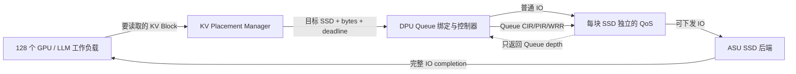

# 从零理解 128 GPU 的 Utility+EDF DPU/QoS 策略

> 本文面向第一次接触本项目的人。阅读本文不要求提前了解 DPU、QoS、
> Token Bucket、WRR、LLM KV Cache 或离散事件仿真。

## 目录

1. [一分钟结论](#1-一分钟结论)
2. [项目究竟在模拟什么](#2-项目究竟在模拟什么)
3. [先理解几个基础概念](#3-先理解几个基础概念)
4. [实验目标和指标是怎么定义的](#4-实验目标和指标是怎么定义的)
5. [LLM 四层流水线语义](#5-llm-四层流水线语义)
6. [Baseline 和旧 CIR 策略](#6-baseline-和旧-cir-策略)
7. [旧 CIR 为什么没有带来足够提升](#7-旧-cir-为什么没有带来足够提升)
8. [本次到底改了什么](#8-本次到底改了什么)
9. [Utility+EDF 策略的完整设计](#9-utilityedf-策略的完整设计)
10. [一个完整的数值决策例子](#10-一个完整的数值决策例子)
11. [DPU 如何把决策写进 QoS](#11-dpu-如何把决策写进-qos)
12. [80 us 控制周期和事件时序](#12-80-us-控制周期和事件时序)
13. [多 SSD owner lock](#13-多-ssd-owner-lock)
14. [为什么新策略会提高平均 GPU 利用率](#14-为什么新策略会提高平均-gpu-利用率)
15. [正式实验结果](#15-正式实验结果)
16. [2/3 SSD 为什么仍未达标](#16-23-ssd-为什么仍未达标)
17. [代码文件导航](#17-代码文件导航)
18. [如何复现实验](#18-如何复现实验)
19. [如何验证结果没有作弊或丢请求](#19-如何验证结果没有作弊或丢请求)
20. [已知限制](#20-已知限制)
21. [常见问题](#21-常见问题)
22. [术语表](#22-术语表)

---

## 1. 一分钟结论

这次提升不是靠提高 SSD 物理带宽，也不是靠减少请求，更不是通过降低
Baseline 得到的。Baseline 和新策略读取完全相同的 456,116 个请求、
67,257,040,896 Byte，单 SSD 物理带宽仍是 40 GB/s。

真正带来提升的是下面三件事：

1. **真正门控等待 Queue**：旧 CIR 策略只给部分 Queue 分配保证带宽，
   但没有禁止其他 Queue 走 EXCESS。新策略把未准入 Queue 同时设置为
   `CIR=0、PIR=0、Queue WRR weight=0`，因此它们确实不能提前灌入 SSD。
2. **选择“现在最值得启动”的 GPU**：尚未进入流水线的 GPU 不再按到达
   顺序处理，而是使用 Utility Density，比较计算收益和 IO 成本。
3. **保护已经进入流水线的 GPU**：已经开始计算的 GPU，其下一层预取有
   明确 deadline；策略使用 EDF（Earliest Deadline First）避免前面已经
   投入的计算因为预取迟到而失效。

正式验证策略是 `utility_edf_integer_l750`（配对运行仍先执行 Baseline）：

| 项目 | 数值 |
|---|---:|
| 1 SSD Baseline 平均 GPU 利用率 | 21.2428136800% |
| 新策略平均 GPU 利用率 | 46.5233917769% |
| 绝对提升 | **25.2805780969 个百分点** |
| 目标 | 46.2428136800% |
| 是否达标 | **是** |

这组正式数值只来自严格 80 us 的机器可读原始结果：
[`experiments/results/utility_edf_strict_80us_validated/summary.json`](../experiments/results/utility_edf_strict_80us_validated/summary.json)。
文件中只配对运行 `baseline` 与 `utility_edf_integer_l750`。Power 公式、多 SSD
点和 fluid 筛选均是未固化探索记录，不能与这份 raw 结果作为同级证据比较。

需要特别区分两类改动：

- “计算当前层、预取下一层”的 LLM 流水线修正同时作用于 Baseline 和新策略，
  它让仿真语义符合要求，但**不是配对提升本身的来源**。
- 真正造成 Baseline 与新策略差异的是 Utility+EDF 排序、PIR/Queue WRR 门控、
  以及 owner lock。

---

## 2. 项目究竟在模拟什么

### 2.1 组件关系



一次读取的路径是：

1. LLM 决定当前应读取哪一层的 KV。
2. KV Placement 决定每个 KV Block 实际位于哪块 SSD。
3. DPU 把 `(GPU, SSD)` 路径固定绑定到一条 QoS Queue。
4. DPU 根据策略设置每条 Queue 的 CIR、PIR 和 Queue WRR 权重。
5. QoS 选择可以下发的 IO，SSD 后端计算真实完成时刻。
6. LLM 收到所有相关 SSD 的 completion 后越过层屏障。

### 2.2 正式实验参数

参数来自 [`config/simulation_config.yaml`](../config/simulation_config.yaml)：

| 参数 | 正式值 |
|---|---:|
| GPU 数量 | 128 |
| 单 GPU 定义算力 | 512 TFLOPS |
| LLM 计算层 | Layer 0～3，共 4 层 |
| Batch Size | 1 |
| 每 GPU 推理次数 | 1 |
| 随机种子 | 6103 |
| 输入 Token 范围 | 100,000～200,000 |
| KV 命中率范围 | 0.50～0.99 |
| 单 SSD 读带宽 | 40,000,000,000 Byte/s |
| QoS Queue 数量 | 每 SSD 256 条 |
| Group 数量 | 每 SSD 8 个 |
| QoS 控制周期 | 80 us |
| KV Block 大小 | 当前工作负载为 147,456 Byte |

不同 SSD 是独立的 StoragePath：每块盘都有自己的 Queue、Token Bucket、
WRR 调度器和 SSD 后端。

---

## 3. 先理解几个基础概念

### 3.1 Queue

Queue 是 QoS 里保存 IO 的 FIFO 队列。本项目使用 `balanced_exclusive` 绑定：
同一块 SSD 上，每个 GPU 固定独占一条 Queue。因此 DPU 看到 Queue depth 时，
能够知道对应 GPU 还有多少个完整 IO 尚未离开 QoS。

128 GPU 时，每块 SSD 使用 128 条不同 Queue，8 个 Group 各 16 条。Queue
namespace 在不同 SSD 之间独立，因此 SSD0 的 `q000` 和 SSD1 的 `q000`
不是同一条 Queue。

### 3.2 CIR

CIR（Committed Information Rate）可以理解成“保证速率”。Queue 有足够
CIR token 时，可以进入 CIR 优先轮。

关键点：**CIR=0 不等于禁止下发。** 如果 PIR 允许，Queue 仍可通过
EXCESS 轮使用空闲带宽。这正是旧策略效果不足的原因之一。

### 3.3 PIR

PIR（Peak Information Rate）是峰值上限：

- `PIR=None` / `uncapped`：不创建 PIR 限速桶。
- `PIR=0`：该 Queue 不能通过 CIR 或 EXCESS 下发。
- 有限正值：Queue 总速率不能超过该值，但新建 token 桶会从空 token 开始。

### 3.4 WRR

WRR（Weighted Round Robin）是加权轮询。这里有两级：

1. 先在 8 个 Group 之间选择。
2. 再在获胜 Group 内选择 Queue。

用户约束要求 Group WRR 固定，因此新策略只动态修改 Queue WRR。Queue
weight=0 表示不参与调度，weight=1 表示正常参与。

### 3.5 Queue depth 与 SSD completion

这两个概念不能混淆：

- Queue depth 变成 0：最后一个 IO 已经离开 QoS、进入 SSD。
- SSD completion：SSD 内部流水线真正完成该 IO。

DPU 只能看到前者，看不到后者。新策略从未读取 SSD completion、inflight、
NAND channel 或未来状态。

### 3.6 Deadline

计算第 L 层时读取第 L+1 层。理想情况下，下一层 KV 应在当前层计算结束前
完成。因此：

```text
prefetch deadline = 当前计算层开始时刻 + 当前层计算时间
```

---

## 4. 实验目标和指标是怎么定义的

### 4.1 单次推理的 GPU 利用率

代码位于 [`qos_ssd_simulator.py`](../qos_ssd_simulator.py) 的
`gpu_utilization_percent()`：

```text
GPU utilization = compute_only_ttft_us / actual_ttft_us * 100%
```

- `compute_only_ttft_us`：4 层纯计算总时间。
- `actual_ttft_us`：从推理到达到首 Token 的真实时间，包含 SSD 等待。

SSD 等待越少，分母越接近纯计算时间，利用率越高。单个 GPU 的理论上限是
100%。

### 4.2 汇总方式

先为 128 次推理分别计算利用率，再做普通算术平均：

```text
mean_util = (U_0 + U_1 + ... + U_127) / 128
```

### 4.3 目标

```text
target = min(baseline_mean_util + 25 个百分点, 99.5%)
```

“个百分点”不是“相对百分比”。例如 21.24% 增加 25 个百分点，目标是
46.24%，不是 `21.24% × 1.25 = 26.55%`。

正式 1 SSD Baseline 是 21.242814%，所以目标是：

```text
21.242814% + 25pp = 46.242814%
```

### 4.4 Read-window 尾部和 TTFT 尾部不是同一个指标

每次推理生成 4 个 read-window 样本，128 个 GPU 一共 512 个：

- L0 没有前一层计算可遮蔽，`delta = initial_read_us`；
- L1～L3 预取的
  `delta = actual_read_us - concurrent_compute_window_us`。

`delta > 0` 表示该次读取超出可遮蔽窗口，`late_gpu_layer_count` 是正 delta
样本数；`p95_delta_us` 和 `worst_delta_us` 则描述这些 512 个 signed delta
的尾部。它们是“层读取相对计算窗口”的指标，不是端到端 TTFT。

因此，策略可能让更少的层读取迟到，却把服务集中带来的等待压到少数尾部 GPU
上，使 read-window P95/worst 变差；同一轮实验的 Mean/P95/Max TTFT 仍可能改善。
第 15 节会同时报告两组指标，不能只选择其中一组。

---

## 5. LLM 四层流水线语义

### 5.1 修改前容易出现的误解

“计算当前层，同时读取当前层”并不符合本实验要求。当前层开始计算时，它所需
KV 应该已经就绪。能和当前计算重叠的是下一层 KV。

### 5.2 当前语义

```text
时间 ───────────────────────────────────────────────────────────>

先读 L0
        │
        ├─ Compute L0 ──────────┐
        └─ Prefetch L1 ─────────┘ max barrier
                                ├─ Compute L1 ───────┐
                                └─ Prefetch L2 ──────┘ max barrier
                                                     ├─ Compute L2 ─────┐
                                                     └─ Prefetch L3 ────┘
                                                                          └─ Compute L3
```

执行规则：

1. 推理开始时只读取 L0，尚不计算。
2. L0 读取完成后，同时执行 Compute L0 和 Prefetch L1。
3. 下一阶段从 `max(Compute L0 done, Prefetch L1 done)` 开始。
4. 同样方式执行 L1/L2 和 L2/L3。
5. L3 是最后一层，只计算，不读取模型范围外的 L4。

实现位于 [`llm_workload/layer_request.py`](../llm_workload/layer_request.py)
的 `LLMWorkload.start_next_layer()` 和 `_finish_layer()`。

### 5.3 层屏障为什么重要

一个层读组可能分布在多块 SSD。它的完成时刻不是各盘时间之和或平均值，而是：

```text
layer IO complete = max(SSD0 complete, SSD1 complete, ...)
layer end = max(compute done, layer IO complete)
```

因此只加速某个 GPU 在 SSD0 上的路径、却不加速它在 SSD1 上的路径，可能对
层完成时间完全没有帮助。这也是必须做跨 SSD owner 协调的原因。

---

## 6. Baseline 和旧 CIR 策略

### 6.1 Baseline

Baseline 不创建 DPU 速率控制器：

```text
Queue CIR = 0
Queue PIR = uncapped
Queue WRR weight = 1
Group WRR weight = 1
```

所有 Queue 都通过 EXCESS 轮竞争 SSD。

### 6.2 旧 `demand_aware_fcfs_cir`

旧策略按到达顺序分配每块 SSD 的 40 GB/s：

```text
remaining = 40 GB/s
for demand in arrival_order:
    assigned = min(requested_rate, remaining)
    remaining -= assigned
```

requested rate 来自：

```text
requested_rate = ceil(path_bytes * 1,000,000 / compute_window_us)
```

但旧策略仍保持：

```text
Queue PIR = uncapped
Queue WRR weight = 1
```

所以没有获得 CIR 的 Queue 并没有被阻断，只是没有“保证”；它们仍会进入
EXCESS 轮。

### 6.3 实际结果

1 SSD 完整仿真：

| 策略 | Mean GPU utilization | 相对 Baseline |
|---|---:|---:|
| Baseline | 21.242814% | - |
| 旧 FCFS-CIR | 18.366473% | -2.876341pp |

旧 FCFS-CIR 在早期 1～10 SSD 诊断扫描中全部没有改善；变化范围约为
-5.414pp～-0.282pp。这组旧策略数字用于解释改进动机，不属于第 15 节严格
80 us raw 的正式配对。

---

## 7. 旧 CIR 为什么没有带来足够提升

### 7.1 它分配的是“带宽保证”，不是“完成顺序”

LLM 关心的是某个 GPU 的整个下一层是否按时完成，而不是每条 Queue 是否公平
获得了一点带宽。平均分散服务可能让很多 GPU 都完成了一半，但没有任何 GPU
及时越过层屏障。

### 7.2 CIR=0 的 Queue 仍会走 EXCESS

旧策略没有 PIR Gate，也没有关闭 Queue WRR。结果是 DPU 的准入意图会被
EXCESS 借用削弱。

### 7.3 FCFS 不理解 GPU 价值

128 个 GPU 的初始读几乎同时到达。FCFS 的“先到”大量由 GPU 注册顺序决定，
没有比较：

- 这个 GPU 的 IO 要花多久；
- 它有多少可被隐藏的计算时间；
- 它是否已经进入流水线；
- 下一层预取什么时候到期。

### 7.4 每块 SSD 独立 FCFS 会破坏 coflow 一致性

同一 GPU 在不同 SSD 上可能得到不同优先级。某一条路径变快、另一条路径仍是
straggler 时，前一条路径的带宽收益被层级 `max()` 屏障浪费。

### 7.5 公平不是当前 mean utilization 目标的最优解

平均 GPU 利用率是 128 个比值的平均。适度集中服务、让部分 GPU 更快进入并
保持计算流水线，往往比同时公平推进所有 GPU 更有效。用户允许尾部退化，
但要求无永久饥饿并完整报告，因此可以使用这种策略，但不能丢弃尾部请求。

---

## 8. 本次到底改了什么

下面区分“直接造成策略差异的改动”和“保证模型/验证正确的支撑改动”。

### 8.1 直接造成利用率提升的改动

| 改动 | 旧行为 | 新行为 | 作用 |
|---|---|---|---|
| Stage 0 排序 | FCFS/均权竞争 | Utility Density | 优先启动收益高、IO 成本低的 GPU |
| Prefetch 排序 | 不看 deadline | EDF | 保护已开始计算的 GPU |
| Queue PIR | 所有 Queue uncapped | 等待 Queue PIR=0 | 真正阻断未准入流量 |
| Queue WRR | 固定为 1 | 等待 Queue weight=0 | 同时阻断 EXCESS 调度资格 |
| Owner 服务 | 可被新请求打散 | burst 开始后锁到 Queue-empty | 避免一个读组被切碎 |
| 跨 SSD | 各盘独立决策 | 同一个 p_node owner | 减少层屏障错配 |

### 8.2 模型和验证支撑改动

| 改动 | 原因 |
|---|---|
| 当前层计算、下一层预取 | 对齐用户指定的 LLM 执行语义 |
| Placement 携带层号、bytes、窗口 | DPU 才能区分初始读和有 deadline 的预取 |
| Dispatcher 聚合每路径请求数和 Block 大小 | 用完整 Queue depth 精确换算剩余 bytes |
| 动态 Queue WRR 控制事件 | 用户指定 Group 固定、Queue 可动态 |
| 跨 StoragePath 控制唤醒 | 一块盘的 owner 变化必须同时唤醒其他盘 |
| Sticky multi-SSD owner lock | 防止另一块盘 depth 快照较旧时错误抢占 |
| t=0 预 park 与严格 80 us 量化 | 防止首个非边界到达在控制真正生效前走默认 EXCESS |
| 通用比较指标 | 自动输出目标、是否达标、TTFT 和尾部变化 |
| 守恒/饥饿断言 | 防止通过丢请求或提前结束仿真制造提升 |

### 8.3 没有改变的内容

- SSD 物理带宽、FCP/BCP/NAND 时序没有改变。
- 请求数量和字节数没有减少。
- 正式达标实验仍使用 random KV Placement。
- QoS 控制周期仍是 80 us。
- Group WRR 始终固定为 1。
- DPU 仍看不到 SSD completion/inflight。
- Baseline 和新策略使用完全相同的负载、seed 和 LLM 流水线。

---

## 9. Utility+EDF 策略的完整设计

实现类是 [`DPU/rate_controller.py`](../DPU/rate_controller.py) 中的
`UtilityEDFController`。

### 9.1 DPU 可使用的信息

请求到达时保存：

- `p_node_id`：GPU/P 节点身份；
- `demand_group_id`：同一个层读组身份；
- `path_bytes`：这个读组在当前 SSD 上的总字节；
- `path_request_count`：对应完整 IO 数量；
- `block_size_bytes`：等长 Block 大小；
- `service_window_us`：当前 GPU 计算窗口；
- `deadline_us`：预取绝对截止时间；
- `compute_layer_index` / `prefetch_layer_index`；
- 推理到达时刻。

运行时只额外读取：

- 当前 DPU 时钟；
- 每块 SSD 的完整 Queue depth。

### 9.2 如何识别 Stage 0 和 Prefetch

```text
compute_layer_index is None  => 初始读取 L0，称为 Stage 0
compute_layer_index != None  => 计算当前层时的下一层预取
```

初始读虽然携带一个 `service_window_us` 用于计算价值，但它没有真正的
compute deadline，不能把它当 EDF prefetch。

### 9.3 用 Queue depth 计算剩余服务时间

当前工作负载 Block 等长，因此：

```text
remaining_bytes = queue_depth * block_size_bytes
b = ceil(remaining_bytes * 1,000,000 / SSD_capacity_bytes_per_second)
```

`b` 的单位是微秒，表示仍由 DPU 控制的 Queue 内容按标称整盘带宽需要多久。
已经进入 SSD、但尚未 completion 的 IO 不在这个数里，因为 DPU 看不到它们。

### 9.4 Stage 0 的 Utility Density

定义：

```text
t = 当前决策时刻
a = 该推理到达时刻
b = 当前剩余 IO 服务时间
c = 单层计算窗口
G = 总计算层数，正式实验为 4

F = (t - a) + b + G*c
U = c / (F * b^2)
```

直觉：

- `c` 大：启动后有更多计算可和 IO 重叠，价值更高。
- `b` 大：占用 SSD 更久，而且使用平方惩罚，价值更低。
- `F` 大：即使现在启动，预计完成已经较晚，边际价值更低。

这里不是声称 `F` 是精确 TTFT，而是把它作为在线、无未来信息的完成时间代理。

### 9.5 DPU 不做除法

比较候选 x 和 y 时，不计算浮点 U，而做交叉乘法：

```text
x 优于 y，当且仅当：

c_x * F_y * b_y^2 > c_y * F_x * b_x^2
```

平局时依次选择：

1. 更小 `b`；
2. 更早到达；
3. 更小的稳定 `p_node_id`。

### 9.6 Prefetch 的 EDF 顺序

已经进入流水线的候选按以下键升序：

```text
(deadline,
 remaining_service_us,
 -completed_coflow_count,
 arrival_sequence,
 p_node_id)
```

主要原则是最早 deadline 优先；其余字段只用于平局和稳定性。

### 9.7 是否允许插入新的 Stage 0

设 Utility 最好的初始候选为 `x`，所有 ready prefetch 按 EDF 排成 `P`：

```python
work = x.remaining_service_us

for p in P:
    work += p.remaining_service_us
    if now_us + work > p.deadline_us + 750:
        return P[0]  # 插入x会破坏某个已进入流水线的GPU，先做EDF

return x             # 所有ready prefetch仍可行，可以启动新GPU
```

750 us 是完整 1 SSD 参数扫描的最好整数版 allowance。判断使用严格 `>`：
恰好等于 `deadline + 750` 时仍视为可行。

### 9.8 非抢占 owner

同一时刻 128 个 GPU 会依次向 DPU 注册。首个 Queue 真正开始下发之前，
后注册但 Utility 更好的候选可以替换当前候选，避免 Python 提交顺序决定结果。

一旦选中 owner 的 Queue depth 开始下降：

```text
owner_locked = True
```

之后即使出现 Utility 更高或 deadline 更早的新请求，也必须等当前读组的所有
路径 Queue-empty 后再重新选择。这对应“整 burst 非抢占”的筛选模型，也避免
频繁重新配置 token。

这个 lock 只属于当前活跃读组，不是跨层 persistent cohort。当前读组的全部
路径排空后，控制器立即释放 owner 并选择其他活跃 p_node；原 p_node 进入计算
空档时不会占着调度槽。为了阻止它的下一层在控制边界前走默认 EXCESS，它的
固定 Queue 仍保持 parked，直到下一层重新被选中，或者四个读组全部完成后恢复
默认状态。

### 9.9 完整伪代码

```text
initialize_utility_mode():
    在t=0把每块SSD上实际绑定给128个p_node的Queue全部设为0/0/0

on_batch_arrival(batch):
    先把全部IO放入QoS，使depth可见
    按(SSD, Queue)聚合bytes、request_count、层号、deadline
    register_demand(metadata)
    choose_and_program_on_inclusive_80us_boundary()

choose_and_program():
    refresh visible queue depths
    build active demand-group candidates

    if current owner has started and still has any path:
        keep current owner
    else:
        initials = sort_by_utility_density(stage0 candidates)
        prefetch = sort_by_edf(prefetch candidates)

        if only initials exist:
            owner = initials[0]
        else if only prefetch exists:
            owner = prefetch[0]
        else if inserting initials[0] violates EDF+750us:
            owner = prefetch[0]
        else:
            owner = initials[0]

    for every managed Queue whose p_node has not completed all 4 read groups:
        if Queue belongs to owner:
            program(CIR=capacity, PIR=uncapped, weight=1)
        else:
            program(CIR=0, PIR=0, weight=0)

on_queue_depth_change(storage_target):
    refresh this SSD depth
    if selected path has started:
        persist owner lock
    remove paths whose depth is zero
    when the current demand group has no remaining path:
        unlock immediately and choose another active owner
        keep the emptied Queue parked across the compute gap
    when this p_node has completed its fourth read group:
        restore all of its fixed Queue paths to (0, uncapped, 1)
    apply resulting writes only on the strictly next 80us boundary
```

---

## 10. 一个完整的数值决策例子

### 10.1 比较两个 Stage 0 GPU

假设当前 `t=a=0`，总层数 G=4：

| GPU | b（IO us） | c（每层计算 us） | F=b+4c |
|---|---:|---:|---:|
| A | 100 | 1000 | 4100 |
| B | 50 | 500 | 2050 |

不用除法，比较 B 是否优于 A：

```text
left  = c_B * F_A * b_A^2
      = 500 * 4100 * 100^2
      = 20,500,000,000

right = c_A * F_B * b_B^2
      = 1000 * 2050 * 50^2
      = 5,125,000,000
```

`left > right`，所以 B 的 Utility 更高。虽然 B 的计算窗口较短，但它的 IO
成本只有 A 的一半，而 IO 在公式中被平方惩罚。

### 10.2 EDF 是否阻止启动 B

假设现在是 10,000 us，B 还需 600 us；同时有一个已经在流水线中的 P：

```text
P remaining = 400 us
P deadline  = 10,000 us
allowance   = 750 us
```

如果先启动 B，再做 P：

```text
预计P完成 = 10,000 + 600 + 400 = 11,000 us
允许最晚   = 10,000 + 750       = 10,750 us
```

11,000 > 10,750，因此不能启动 B，先服务 P。

如果 P 的 deadline 是 10,400 us：

```text
允许最晚 = 11,150 us
预计完成 = 11,000 us
```

此时插入 B 仍可行，可以启动新的 GPU。

---

## 11. DPU 如何把决策写进 QoS

### 11.1 Queue 状态

| 状态 | CIR | PIR | Queue weight | 含义 |
|---|---:|---:|---:|---|
| RUNNING owner | 40 GB/s | uncapped | 1 | 当前唯一准入 owner |
| WAITING 或层间空档 | 0 | 0 | 0 | CIR/EXCESS 双重阻断；不表示保留 owner |
| p_node 四个读组全部结束 | 0 | uncapped | 1 | 恢复硬件默认状态 |
| 未绑定的 128 条 Queue | 0 | uncapped | 1 | Utility 不管理，也不产生无用控制写 |

### 11.2 为什么等待 Queue 同时需要 PIR=0 和 weight=0

- 只设 CIR=0：仍可能走 EXCESS。
- 只设 weight=0：是调度层阻断，但 PIR=0 还能形成独立的速率安全边界。
- 两者同时设置：控制意图明确，也方便测试检查 Gate vector。

### 11.3 为什么选中 Queue 的 PIR 不是 40 GB/s

速率更新会重建 Token Bucket，并清空新桶 token。如果每次 owner 切换都把 PIR
设成 40 GB/s，新 owner 在本次 80 us `rate_update` 后可能还要等下一次 refill。
RUNNING Queue 使用 `PIR=uncapped`，因此 Gate 在控制边界打开后，可以先通过
EXCESS 下发，后续再使用 CIR token。

早期 fluid/Power 筛选曾给出下面的 bubble 敏感性：

| 每次 owner 换手 bubble | Power 版预测利用率 |
|---:|---:|
| 0 us | 46.715% |
| 40 us | 46.403% |
| 80 us | 46.070% |

因此 RUNNING Queue 使用 `PIR=uncapped`，可立即通过 EXCESS；但所有 WAITING
Queue 都是 PIR=0/weight=0，所以不会泄漏竞争流量。SSD 后端仍保证整盘物理
上限是 40 GB/s。上表只是未固化探索记录，不在严格 80 us raw summary 中，
不能用它替代第 15 节的完整 batched-exact 结果。

### 11.4 Group WRR 始终固定

新策略从不调用动态 Group weight 接口。正式结果：

```text
group_weight_write_count = 0
```

只动态更新 Queue 权重，符合用户给定的硬件能力边界。

---

## 12. 80 us 控制周期和事件时序

严格契约是：**Utility+EDF 的 CIR、PIR 和 Queue WRR 只能在 QoS 的 80 us
控制网格上生效**。数据请求本身仍按真实到达时刻进入 Queue；被量化的是控制写，
不是 IO arrival。

正式配置从 `start_time_us=0` 开始，因此合法控制时刻是：

```text
0, 80, 160, 240, ... us
```

### 12.1 为什么 t=0 必须先 park 128 条 Queue

每块 SSD 配置了 256 条 Queue，但 `balanced_exclusive` 只把其中实际绑定的
128 条交给 128 个 p_node。Utility gateway 初始化时在 t=0 把这 128 条受管
Queue 预先设置为：

```text
(CIR=0, PIR=0, Queue weight=0)
```

没有这一步，假如第一批数据在 t=7 us 到达，Queue 会沿用 Baseline 默认的
`PIR=uncapped, weight=1`，从 7 us 到 80 us 之间可能先走 EXCESS，控制器到
下一 tick 才能补救。未使用的另 128 条 Queue 不预 park，保持默认值，也不会
膨胀控制写统计。若某种通用 binding 没有暴露预绑定映射，gateway 才保守地
fallback 到该 SSD 的全部 Queue。

### 12.2 同一时间戳的阶段顺序

QoS 内部同一时间戳的阶段顺序是：

```text
1. token_refill
2. rate_update（CIR/PIR、Group/Queue WRR）
3. io_arrival
4. scheduler_dispatch
```

在全局事件循环中，GPU 层就绪/submit 的优先级早于 QoS 处理。因此“请求到达”
和“Queue-empty 回调”虽然都可能发生在边界 t=80，它们能否使用这个边界并不
相同。

### 12.3 Arrival 使用 inclusive ceil

新 batch 在时刻 `t` 到达时，控制生效时刻是：

```text
arrival_effective(t) = ceil_to_80us_grid(t)
```

这里的 ceil 是 inclusive：t=7 映射到 80，t=80 仍映射到 80。后者合法是因为
GPU submit 在同时间戳的 QoS `rate_update` 之前运行，命令来得及进入本边界。
t=7 的数据可以立即进入已预 park 的 Queue，但在 t=80 打开 Gate 前不能下发。

### 12.4 Queue-empty 使用 strictly-next boundary

Queue-empty observer 从 QoS 的 `scheduler_dispatch` 阶段触发；此时本时间戳的
`rate_update` 已经过去。因此 observer 引起的本盘换手和跨 SSD 协同写统一使用：

```text
empty_effective(t) = floor_to_80us_grid(t) + 80 us
```

即使 empty 恰好发生在 t=80，也必须到 t=160 才生效；t=97 同样映射到 160。
不能在回调后对 t=80 再调用一次 QoS process 来“补生效”，那会违反硬件控制
阶段已经结束的事实。

### 12.5 同 tick 多次写入以最后状态为准

同一 Queue 可能因为同刻多个 GPU submit 或全局重算，在同一个控制 tick 先被
打开、后又被 park。事件引擎对相同 `(effective_time, queue_id)` 保留最后一条
CIR/PIR 状态，Queue WRR 的同 Queue 字段也以最后值覆盖。因此 t=80 的
`open -> park` 最终应用的是 `(0,0,0)`，不会在两个命令之间下发 IO。

### 12.6 Park 跨层保留，但 owner 不跨层保留

当前读组最后一条路径 Queue-empty 后，owner lock 立即释放，控制器可以选择
其他活跃 p_node；它不会为了等待同一 p_node 的下一层而保留 owner/槽位。

但是，只要该 p_node 尚未完成全部四个读组，它固定绑定的 Queue 就继续保持
`(0,0,0)`。下一层到达时必须等 inclusive-ceil 得到的控制边界真正打开 Gate，
不能利用层间默认 EXCESS 偷跑。第四个读组完成后，才把该 p_node 在所有 SSD
上的固定路径恢复为 `(0, uncapped, 1)`。

### 12.7 事件驱动重算仍服从控制网格

策略主要在两个可观察事件上重算：

1. 新 batch 到达；
2. Queue depth 变化，尤其是 Queue-empty。

这样做的原因：

- Utility/EDF 在没有新到达或完成时没有必要抖动。
- 重复写入相同速率可能反复清空 token。
- 当前 owner 整 burst 非抢占，80 us tick 不能把它随意换走。

控制事件只在目标状态确实变化时写硬件；相同状态重算返回空更新，不增加
rate/weight write count。重算可以发生在数据事件时刻，但命令的
`effective_time_us` 必须按上面的 arrival/observer 规则落到 80 us 网格。

跨 SSD owner 变化时，某一块 SSD 的回调需要立即触发另一块 SSD 的重算。为此
[`simulation_common/storage_path.py`](../simulation_common/storage_path.py)
会把另一条 StoragePath 的下一次 QoS 唤醒提前到算出的**下一控制边界**；它
不会让控制在 Queue-empty 的任意微秒或已经过去的同一 tick 生效。

---

## 13. 多 SSD owner lock

### 13.1 问题

同一读组可能在 SSD0 和 SSD1 上各有一条路径。SSD0 路径先 Queue-empty 时，
SSD1 的真实 depth 可能已经下降，但 DPU 缓存仍是旧快照。

如果先删除 SSD0 路径，再根据旧 SSD1 depth 判断“owner 尚未开始”，控制器可能
错误切到新 owner，破坏整 burst 非抢占。

### 13.2 修复

删除 selected owner 的任何 empty path 之前，只要观察到：

```text
depth < original_path_request_count
```

就先持久设置 `owner_locked=True`。只要同 owner 在任意 SSD 还有候选路径，
`_choose_candidate()` 都直接保留它；最后一条路径消失后自动解锁。

回归测试位于
[`tests/test_utility_edf_multissd_owner_lock.py`](../tests/test_utility_edf_multissd_owner_lock.py)。

### 13.3 它仍然没有使用 SSD 内部状态

sticky lock 只根据 DPU 可见的 Queue depth 判断“这条路径曾开始下发”。它没有
查询另一块盘的 completion 或 inflight。

---

## 14. 为什么新策略会提高平均 GPU 利用率

### 14.1 Baseline 的问题是“大家都在读，但很少有人及时读完”

单 SSD 总需求远大于 40 GB/s。均权 EXCESS 让很多 Queue 交错推进，GPU 的
下一层预取容易错过计算窗口。

### 14.2 Utility 把 SSD 时间给边际收益更高的 GPU

对于相同 SSD 服务时间：计算窗口更长的 GPU 更容易把 IO 隐藏在计算后面；
对于相同计算窗口：IO 更短的 GPU 更容易快速进入流水线。Utility Density
把两者合成一个在线优先级。

### 14.3 EDF 避免浪费已经投入的工作

一旦 GPU 完成初始读并开始计算，如果下一层预取迟到，之前创造的计算/IO 重叠
会被 stall 抵消。EDF 优先保护这些已有投入，而不是无限启动新 GPU。

### 14.4 Gate 让排序真正生效

如果 WAITING Queue 仍能走 EXCESS，再好的排序也只是建议。PIR=0 和 weight=0
使 DPU 的 owner 选择真正决定 SSD 接下来接收谁的 IO。

### 14.5 Owner lock 避免把一个有效 burst 切碎

每次只完成一点又切到其他 GPU，会增加 token 重配、SSD pipeline 混杂和 deadline
不可预测性。在早期未固化探索中，非抢占 burst 也缩小了轻量筛选模型与完整
SSD 仿真的行为差异；正式收益仍以第 15 节 raw 为准。

### 14.6 这不是增加总吞吐

Baseline 和新策略的单 SSD 最后完成时刻完全相同：1,681,488.92 us。说明策略
没有创造带宽，它只是改变了 128 个 GPU 获得服务的顺序，让更多计算等待被
隐藏，从而提高平均 `compute / TTFT`。

---

## 15. 正式实验结果

本节唯一的正式机器可读来源是：
[`experiments/results/utility_edf_strict_80us_validated/summary.json`](../experiments/results/utility_edf_strict_80us_validated/summary.json)。

它记录了最终代码、严格 80 us 控制契约、seed 6103、1 SSD、128 GPU、random
Placement 和 batched-exact SSD 后端下的一次完整配对运行。正式 raw 只包含
Baseline 与 `utility_edf_integer_l750`；本节不会把其他探索点混入正式表格。

### 15.1 利用率

| 策略 | Mean GPU util | 增益 | 是否达到 46.2428136800% |
|---|---:|---:|---:|
| Baseline | 21.2428136800% | - | 否 |
| Utility+EDF integer L750 | **46.5233917769%** | **+25.2805780969pp** | **是** |

新策略超过目标 `0.2805780969pp`。这些小数直接来自 raw JSON，表格没有使用
轻量模型预测值替换完整仿真值。

### 15.2 端到端 TTFT 改善

| 指标 | Baseline | Integer L750 | 变化 |
|---|---:|---:|---:|
| Mean TTFT | 1491.869930 ms | 921.478135 ms | -570.391796 ms（-38.233346%） |
| P95 TTFT | 1719.904988 ms | 1595.285238 ms | -124.619751 ms（-7.245735%） |
| Max TTFT | 1741.571181 ms | 1685.365122 ms | -56.206059 ms（-3.227319%） |
| Min GPU utilization | 0.939300% | 0.912643% | -0.026657pp |

Mean/P95/Max TTFT 都改善，但最差单 GPU 利用率下降了 0.026657pp。端到端
TTFT 改善不代表每一种层级尾部指标都改善。

### 15.3 Read-window 尾部退化

第 4.4 节定义的 512 个 read-window signed delta 给出另一幅图景：

| 指标 | Baseline | Integer L750 | 变化 |
|---|---:|---:|---:|
| `late_gpu_layer_count` | 510 | 207 | -303（-59.412%） |
| P95 read-window delta | 552.923 ms | 1221.268 ms | **+120.875%** |
| Worst read-window delta | 706.326 ms | 1652.204 ms | **+133.915%** |

也就是说，正 delta 的样本从 510 个降到 207 个：更多读取被计算窗口遮蔽；但
服务集中使剩余少数慢样本更慢，P95 delta 从 552.923 ms 增至 1221.268 ms，
worst 从 706.326 ms 增至 1652.204 ms。这正是用户允许、但要求完整报告的
尾部退化。它与上一表不矛盾：上一表按完整推理统计 TTFT，这一表按层读取相对
可遮蔽窗口统计 signed delta。

### 15.4 完整性与无饥饿

```text
completed_inference_count = 128
completed_coflow_count    = 512
starved_p_node_count      = 0
request_count             = 456,116
byte_count                = 67,257,040,896
```

最慢样本仍然完成，`active_demand_count=0`，因此这里是有限工作负载上的尾部
重排，不是永久饥饿或通过丢请求制造的提升。

### 15.5 严格 80 us 控制面审计

```text
Queue CIR/PIR writes             = 1,158
Queue WRR writes                 = 1,030
Group WRR writes                 = 0
80us-grid-aligned control writes = 2,188
non-tick control writes          = 0

CIR dispatches                   = 439,215
EXCESS dispatches                = 16,901
selection changes                = 516
EDF conflicts                    = 379
```

`2,188 = 1,158 + 1,030`；所有 Queue rate/weight 写都落在 80 us 网格上，
没有一条 non-tick 写。16,901 个 EXCESS dispatch 来自已在合法边界打开的
RUNNING owner，并不表示 parked Queue 泄漏。Group WRR 写为 0，仍保持静态。

### 15.6 Power、multi-SSD 和 fluid 数字的证据级别

Power 公式、2/3 SSD 扫描和轻量 fluid/screening 数字来自早期搜索文件，均未按
最终 t=0 预 park、arrival inclusive-ceil、Queue-empty strict-next 的完整契约
固化为本节 raw。它们可以解释算法选择过程、帮助提出下一轮候选，但不能宣称
是最终代码的正式复现结果，也不能与 46.5233917769% 放在同一证据等级。

---

## 16. 2/3 SSD 为什么仍未达标

本节全部数字都是**未固化探索记录**。它们不在
`utility_edf_strict_80us_validated/summary.json` 中，且尚未用最终严格 80 us
契约重新生成，因此只能说明搜索历史，不能当作正式 multi-SSD 验收结论。

### 16.1 早期完整随机 Placement 探索

| SSD | Baseline | 最佳完整仿真 | 增益 | 目标 | 差距 |
|---:|---:|---:|---:|---:|---:|
| 2 | 39.009349% | 60.833649% | +21.824301pp | 64.009349% | -3.175699pp |
| 3 | 51.258133% | 68.806700% | +17.548566pp | 76.258133% | -7.451434pp |

### 16.2 早期 fluid/筛选探索过但没有越线的方向

- Whole-p_node affinity；
- 每 GPU 固定少数 SSD 的连续 chunk；
- 全 SSD 等长 stripe；
- 严格 gang/coflow；
- Soft coverage boost；
- Persistent cohort；
- progress-aware 和 remaining-shortest；
- late abandonment；
- 负/正 EDF allowance；
- 80 us 抢占；
- layer 级 whole-burst 零成本热点迁移；
- 严格可行调度轨迹的 200 万次局部搜索。

早期轻量 fluid 筛选最好值为 2 SSD 61.264236%、3 SSD 69.861451%，仍未达到
各自目标。这些预测值不是 batched-exact raw，也没有按最终控制时序固化。

多 SSD 时 Baseline 已经比单盘高很多，仍要求再加 25pp，目标越来越接近 100%；
与此同时，随机 Placement 的跨盘最大路径屏障仍存在。当前搜索没有发现一个既
公平、不闲置 SSD、不降低 Baseline、也不读取未来状态的 2/3 SSD 越线策略。

不能据此数学证明 2/3 SSD 永远不可能达标；只能说早期探索没有找到候选。
要形成正式结论，必须使用最终代码重新运行完整 strict-80us multi-SSD 配对，
生成独立 raw summary，并再次检查守恒、无饥饿和 non-tick write=0。

---

## 17. 代码文件导航

建议按下面顺序阅读。

### 17.1 LLM 与请求生成

| 文件 | 重点 | 本次变化 |
|---|---|---|
| [`llm_workload/layer_request.py`](../llm_workload/layer_request.py) | `LLMWorkload.start_next_layer()`、`_finish_layer()` | 首层先读；计算 L 时预取 L+1；末层不再读 |
| [`llm_workload/kv_placement_manager.py`](../llm_workload/kv_placement_manager.py) | `build_requests()` | 按 SSD 聚合 bytes，传层号、窗口、读组 ID |

### 17.2 DPU

| 文件 | 重点 | 本次变化 |
|---|---|---|
| [`DPU/dispatcher.py`](../DPU/dispatcher.py) | `submit_batch()`、`_control_effective_time_us()` | t=0预park、聚合metadata、读取完整depth、按来源量化并写CIR/PIR/Queue WRR |
| [`DPU/rate_controller.py`](../DPU/rate_controller.py) | `UtilityEDFController` | Utility、EDF、Gate、读组owner lock、跨层park、四组后恢复、统计 |
| [`DPU/__init__.py`](../DPU/__init__.py) | 导出类 | 导出 UtilityEDFController |

`CoflowPriorityController`及其多种 ordering 是搜索阶段保留的实验策略，不是默认
正式策略。

### 17.3 QoS 和事件引擎

| 文件 | 重点 | 本次变化 |
|---|---|---|
| [`qos/schedulers/weighted_round_robin.py`](../qos/schedulers/weighted_round_robin.py) | `set_weights()` | 支持运行时部分更新；weight=0 排除 Queue |
| [`qos/schedulers/hierarchical.py`](../qos/schedulers/hierarchical.py) | `set_queue_weights()` | 只改 Queue，Group 权重保持固定 |
| [`discrete_simulation/simulator.py`](../discrete_simulation/simulator.py) | Queue weight 控制事件 | CIR/PIR/Group/Queue 更新进入统一事件时序；同tick最后字段值生效 |
| [`simulation_common/storage_path.py`](../simulation_common/storage_path.py) | 控制事件唤醒 | 跨SSD重算唤醒目标路径，但控制仍落在下一合法tick |

### 17.4 入口、配置、指标

| 文件 | 重点 | 本次变化 |
|---|---|---|
| [`qos_ssd_simulator.py`](../qos_ssd_simulator.py) | 策略解析、run、summary | 支持 `utility_edf_<mode>_l<us>`，目标与TTFT对比，守恒/饥饿检查 |
| [`config/simulation_config.yaml`](../config/simulation_config.yaml) | 唯一正式配置 | 128 GPU、512 TFLOPS、1～10 SSD、默认 integer L750 |

### 17.5 测试

| 文件 | 覆盖内容 |
|---|---|
| [`tests/test_next_layer_prefetch.py`](../tests/test_next_layer_prefetch.py) | 四层下一层预取语义 |
| [`tests/test_dynamic_queue_wrr.py`](../tests/test_dynamic_queue_wrr.py) | 动态 Queue 权重、0权重、部分更新 |
| [`tests/test_cross_storage_control_wakeup.py`](../tests/test_cross_storage_control_wakeup.py) | 跨SSD控制唤醒与统一调度 |
| [`tests/test_utility_edf_controller.py`](../tests/test_utility_edf_controller.py) | 公式、EDF边界、depth、owner lock、parser |
| [`tests/test_utility_edf_multissd_owner_lock.py`](../tests/test_utility_edf_multissd_owner_lock.py) | 多SSD陈旧depth与sticky lock |
| [`tests/test_utility_edf_strict_80us_contract.py`](../tests/test_utility_edf_strict_80us_contract.py) | t=0预park、inclusive/strict-next边界、同tick覆盖、跨层park、第四组恢复 |
| [`tests/test_policy_comparison_metrics.py`](../tests/test_policy_comparison_metrics.py) | 25pp目标、TTFT变化、99.5%封顶 |

---

## 18. 如何复现实验

以下命令均从项目根目录执行：

```bash
cd <repo-root>
```

### 18.1 运行默认 1～10 SSD 扫描

当前统一配置默认比较 Baseline 和整数 Utility+EDF：

```bash
python qos_ssd_simulator.py --config config/simulation_config.yaml
```

输出：

```text
experiments/results/utility_edf_topology_scan/summary.json
```

这条 1～10 SSD 命令是重新探索拓扑的入口，不会自动成为第 15 节的正式证据。
只有在完整运行结束并独立核对严格控制统计后，才能固化新的多 SSD raw。

### 18.2 复现正式配置的 1 SSD 配对

下面只在内存中覆盖 SSD 列表和输出路径，不修改 YAML。复现结果写入单独的
`utility_edf_strict_80us_reproduced` 目录，不覆盖第 15 节保留的正式 raw：

```bash
python - <<'PY'
from qos_ssd_simulator import load_simulation_config, run_configured_experiment

config = load_simulation_config()
config["topology"]["ssd_counts"] = [1]
config["dpu"]["rate_control"]["strategies"] = [
    "baseline",
    "utility_edf_integer_l750",
]
config["experiment"]["output_file"] = (
    "experiments/results/utility_edf_strict_80us_reproduced/summary.json"
)

run_configured_experiment(config)
PY
```

### 18.3 读取并验收复现结果

不依赖 `jq`：

```bash
python - <<'PY'
import json

path = "experiments/results/utility_edf_strict_80us_reproduced/summary.json"
with open(path, encoding="utf-8") as stream:
    result = json.load(stream)

topology = result["topologies"]["1_ssd"]
baseline = topology["baseline"]
policy = topology["utility_edf_integer_l750"]
comparison = topology["comparisons"]["utility_edf_integer_l750"]
aligned = policy["control_update_tick_aligned_write_count"]
written = (
    policy["rate_control_write_count"]
    + policy["queue_weight_write_count"]
    + policy["group_weight_write_count"]
)

assert comparison["meets_target"] is True
assert policy["rate_control"]["completed_coflow_count"] == 512
assert aligned == written == 2188
assert policy["control_update_non_tick_write_count"] == 0

print("baseline =", baseline["mean_gpu_utilization_percent"])
print("policy   =", policy["mean_gpu_utilization_percent"])
print("compare  =", comparison)
print("aligned  =", aligned)
print("non-tick =", policy["control_update_non_tick_write_count"])
PY
```

### 18.4 运行测试

```bash
python -m unittest discover -s tests -v
python -m py_compile \
  DPU/rate_controller.py DPU/dispatcher.py qos_ssd_simulator.py \
  discrete_simulation/simulator.py simulation_common/storage_path.py \
  llm_workload/layer_request.py llm_workload/kv_placement_manager.py
git diff --check
```

当前预期：81/81 测试通过，其中严格 80 us 契约测试为 7/7；
`py_compile` 和 `git diff --check` 均应无输出并返回 0。

---

## 19. 如何验证结果没有作弊或丢请求

### 19.1 Baseline 与策略重新创建完整仿真

每个策略调用 `build_simulation()` 创建全新 GPU、QoS、Token、SSD 和事件循环，
不会复用上一轮可变状态。

### 19.2 随机工作负载在事件循环开始前固定

输入 Token 和命中率由 `(seed, gpu_id, inference_index)` 派生。调度顺序不会
改变下一次抽样，所以两个策略的负载身份一致。

### 19.3 请求和字节三侧守恒

`summarize_run()` 检查：

```text
GPU generated requests == QoS dispatched requests == SSD completed requests
GPU generated bytes    == QoS dispatched bytes    == SSD completed bytes
```

任一不相等都会抛出异常，而不是输出一个看似更高的利用率。

### 19.4 推理完成和饥饿检查

正式运行必须满足：

```text
completed inference count == expected inference count
active DPU demands == 0
```

否则 summary 直接失败。Utility+EDF 还报告每个 p_node 的 completed coflow
数量，正式结果 `starved_p_node_count=0`。

### 19.5 相同 SSD 物理工作量

1 SSD Baseline 和新策略最后完成时刻相同，请求/字节相同。策略只改变顺序，
没有修改 SSD 参数或跳过后端流水线。

---

## 20. 已知限制

### 20.1 Queue-empty 不是 SSD completion

DPU 在最后一个 IO 离开 QoS 时轮换 owner，此时旧 owner 仍可能有 IO 在 SSD
内部。策略保证的是 QoS Queue 级 burst 不被打散，不是 NAND completion 级
绝对非交错。

### 20.2 DPU 算法执行延迟没有单独建模

控制更新已经严格量化到 80 us 网格，但仿真没有为 Python 排序/大整数运算额外
增加 DPU 指令执行时间。整数公式的运算路径比探索性的 Power 公式简单；落硬件
前仍应在目标 RISC-V 上测量最坏 128 候选比较耗时。

### 20.3 当前正式负载是有限批次

128 个 GPU 各一次推理，所有到达最终停止。严格优先不会造成永久饥饿，因为
每个 owner 工作量有限且完成后被删除。

如果未来改成无限持续到达，需要增加 max-wait aging 或 admission quota，才能
对长期服务做形式化无饥饿保证。

### 20.4 Block 等长假设

当前 `remaining_bytes = depth * block_size` 在正式 KV Block 等长时精确。若未来
允许同一 Queue 混合不同 IO 大小，只看 depth 不够，需要 DPU 保存该 Queue 的
FIFO size 前缀和或硬件提供 byte depth。

### 20.5 只在固定正式 seed 上做了完整达标证明

额外 seed 的轻量 fluid 结果只是未固化探索记录。最终“达标”结论只来自
strict-80us raw 中 seed 6103 的完整 batched_exact 仿真。若目标变成多 seed
统计保证，应为每个 seed 重新跑完整 SSD 仿真并报告置信区间。

### 20.6 目前只有 1 SSD 正式达标

2/3 SSD 做过广泛探索但尚未用最终严格 80 us 契约固化 raw。第 16 节的数字
不能作为正式失败证明；文档也不会把筛选模型或只用一块盘的热点方案算作多盘
达标。

---

## 21. 常见问题

### Q1：为什么不直接把所有 GPU 的 CIR 调大？

因为单盘物理容量固定为 40 GB/s，所有 requested rate 之和远大于容量。CIR 只能
重新分配带宽，不能创造带宽。更重要的是 LLM 需要某些完整读组及时完成，而
不是所有 Queue 都公平得到一点速率。

### Q2：为什么一次只选一个 owner？会不会浪费 SSD？

在 1 SSD 正式策略中，一个 owner 的 PIR uncapped，能够独占借用整盘带宽，
因此只要 Queue 非空就不会因为 K=1 主动闲置 SSD。多个 owner 同时准入会重新
引入交错完成问题。

### Q3：为什么 CIR=40 GB/s 还要 PIR uncapped？

CIR 桶刚重配置时 token 是空的。PIR uncapped 允许 owner 在合法控制 tick
打开 Gate 后先走 EXCESS，避免再等下一次 80 us refill。等待 Queue 的 PIR=0，
所以不会一起抢占。

### Q4：这是不是牺牲了某些 GPU？

策略允许不同 GPU 完成顺序更加不均匀。正式结果中最差单 GPU 利用率下降
0.026657pp，read-window P95/worst delta 分别退化 120.875%/133.915%；但所有
128 个 GPU 都完成，P95/Max TTFT 分别改善 7.246%/3.227%，没有永久饥饿。

### Q5：Power 探索曾更高，为什么不把它当正式结果？

早期文件中 Power 候选曾比整数候选高约 0.188pp，但它不是最终严格 80 us raw
的一部分，也需要更大的整数幂比较或定点近似。现在只能把它视为待重新验证的
探索候选；正式达标结论仅属于整数版。

### Q6：策略是否知道未来哪个 IO 先在 SSD 完成？

不知道。它只知道请求到达时元数据、当前时钟和 Queue depth。Deadline 来自
应用计算窗口，不是 SSD 未来完成预测。

### Q7：为什么 2/3 SSD 反而更难达到“再加 25pp”？

早期探索中，更多 SSD 已经让 Baseline 利用率明显提高，所以目标也一起提高：
2 SSD 约 64.01%，3 SSD 约 76.26%。可被调度重新排序消除的等待比例变小，而
跨盘 barrier 仍在，因此同样 25pp 的绝对提升更难。这些数值尚不是最终严格
80 us multi-SSD raw，只能解释难点。

### Q8：修改 LLM 流水线是不是让新策略占了便宜？

不是。Baseline 和新策略都使用相同的“计算当前层、预取下一层”语义。配对
提升只来自 DPU/QoS 调度差异。

---

## 22. 术语表

| 术语 | 本文含义 |
|---|---|
| GPU utilization | 纯计算时间 / 实际 TTFT |
| TTFT | Time To First Token，从推理到达到首 Token |
| KV Cache | LLM 历史 Token 的 Key/Value 状态 |
| KV Block | SSD 上的固定粒度 KV 读取单元 |
| DPU | 负责 Queue 绑定、状态观察和 QoS 控制的处理器 |
| QoS | 根据 CIR/PIR/WRR 决定 IO 下发顺序的模块 |
| CIR | 保证速率；有 token 时进入优先轮 |
| PIR | 峰值上限；0 表示完全阻断，uncapped 表示无 PIR 桶 |
| WRR | 加权轮询调度 |
| EXCESS | 没有 CIR 资格时借用空闲带宽的调度轮 |
| Queue depth | 尚未离开 QoS 的完整 IO 数量 |
| Demand group / coflow | 同一 GPU 同一层、可能跨多 SSD 的一组读取 |
| Stage 0 | 推理启动时、尚未计算前的 L0 初始读取 |
| Prefetch | 计算当前层时读取下一层 KV |
| EDF | Earliest Deadline First，最早截止期优先 |
| Utility Density | 计算收益相对 IO 时间和预计完成时间的优先级 |
| Owner | 当前被 DPU 唯一准入的 p_node/GPU |
| Owner lock | owner 开始下发后保持到当前读组的所有路径 Queue-empty |
| Allowance | EDF deadline 后允许的少量调度裕量，默认 750 us |
| Percentage point | 百分点；21% 到 46% 是 +25pp |
